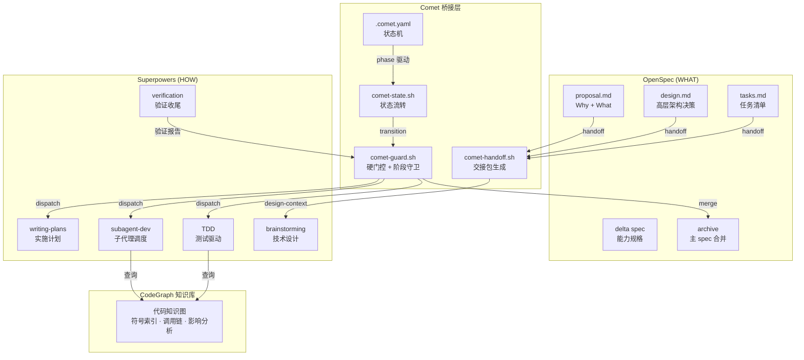
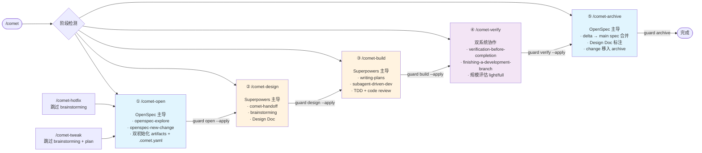
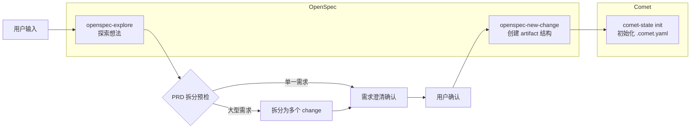
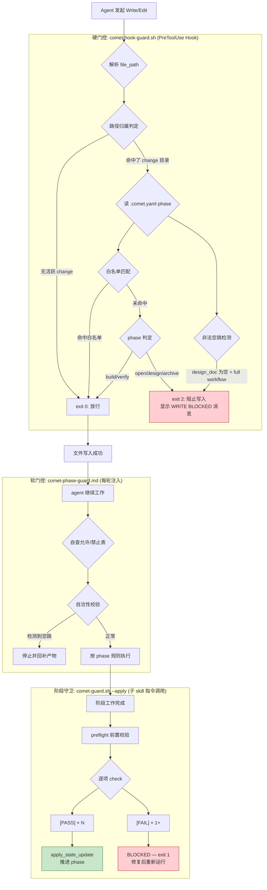
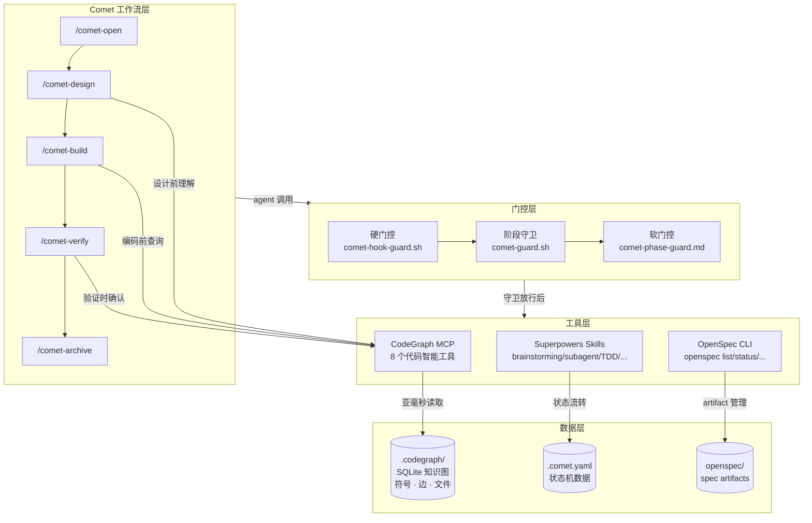

# Comet：OpenSpec 与 Superpowers 的双星整合架构

## 一、核心哲学

Comet 把 OpenSpec 和 Superpowers 视为**围绕同一目标运转的双星系统**，各司其职、边界清晰：

```
OpenSpec 负责 WHAT  — 大纲、提案、spec 生命周期、归档
Superpowers 负责 HOW — 技术设计、计划、执行、收尾
```

它不是把两套系统合并成一个，而是让它们保持独立的同时，通过一套精心设计的**桥接基础设施**无缝协作。



---

## 二、整合的五个维度

### 1. 双文件树 — 物理隔离，逻辑关联

```
openspec/                              # ← OpenSpec 领地（WHAT）
├── changes/<name>/
│   ├── .openspec.yaml                 # OpenSpec 元数据
│   ├── .comet.yaml                    # ★ 桥接文件（Comet 状态机）
│   ├── proposal.md                    # Why + What
│   ├── design.md                      # 高层架构决策（OpenSpec 层级）
│   ├── specs/<capability>/spec.md     # Delta 能力规格
│   ├── tasks.md                       # 任务清单
│   └── .comet/
│       ├── handoff/                   # ★ 阶段交接包（脚本生成）
│       └── subagent-progress.md       # ★ 子代理调度检查点
└── specs/<capability>/spec.md         # 主 specs（归档时合并）

docs/superpowers/                      # ← Superpowers 领地（HOW）
├── specs/YYYY-MM-DD-<topic>-design.md # 技术设计文档（RFC 级别）
└── plans/YYYY-MM-DD-<feature>.md      # 实施计划（文件头含 change 关联）
```

关键设计：`.comet.yaml` 是桥接枢纽，它**物理上**存在于 OpenSpec 的 change 目录中，但**逻辑上**驱动整个 Superpowers 的执行流程。

---

### 2. `.comet.yaml` — 状态机桥接层

这是整合的**核心数据契约**，一条记录同时承载两套系统的信息：

```yaml
# OpenSpec 侧字段
workflow: full          # full | hotfix | tweak
phase: build            # open → design → build → verify → archive

# Superpowers 侧字段
design_doc: docs/superpowers/specs/2026-07-01-auth-design.md  # 指向 Superpowers 产物
plan: docs/superpowers/plans/2026-07-01-auth-implementation.md
build_mode: subagent-driven-development  # Superpowers 执行方式
tdd_mode: tdd                             # Superpowers TDD 约束
review_mode: standard                     # Superpowers 审查策略
isolation: worktree                       # Superpowers 隔离方式

# 桥接字段
base_ref: a1b2c3d4...     # git SHA，用于跨系统验证改动规模
handoff_context: ...       # 交接包路径 + SHA256 哈希
handoff_hash: <sha256>
verify_result: pass        # 验证结论
archived: false            # 归档状态
```

**关键约束**：
- 状态字段**只能**通过 `comet-state.sh` 脚本修改，禁止手工编辑
- 阶段推进**只能**通过 `comet-guard.sh --apply` 完成，脚本会校验所有前置条件
- `build → verify` 前，必须已选择 `build_mode`、`tdd_mode`、`review_mode`、`isolation`

**完整字段表**：

| 字段 | 含义 | 归属 |
|------|------|------|
| `workflow` | `full`、`hotfix` 或 `tweak` | Comet |
| `phase` | 当前阶段：`open`→`design`→`build`→`verify`→`archive` | Comet |
| `design_doc` | Superpowers Design Doc 路径 | Superpowers |
| `plan` | Superpowers Plan 路径 | Superpowers |
| `base_ref` | init 时的 git SHA，用于规模评估 | 桥接 |
| `build_mode` | 执行方式：`subagent-driven-development` / `executing-plans` / `direct` | Superpowers |
| `build_pause` | build 阶段暂停点：`null` 或 `plan-ready` | Comet |
| `subagent_dispatch` | `null` 或 `confirmed`，确认后台调度能力 | Superpowers |
| `tdd_mode` | `tdd` 或 `direct` | Superpowers |
| `review_mode` | `off` / `standard` / `thorough` | Superpowers |
| `isolation` | `branch` 或 `worktree` | Superpowers |
| `direct_override` | full workflow 使用 `build_mode: direct` 时须为 `true` | Comet |
| `verify_mode` | `light` 或 `full` | Comet |
| `verify_result` | `pending` / `pass` / `fail` | Comet |
| `verification_report` | 验证报告路径 | Comet |
| `branch_status` | `pending` 或 `handled` | Comet |
| `auto_transition` | `true`/`false`，控制阶段守卫后是否自动调用下一 skill | Comet |
| `created_at` | 创建日期 | Comet |
| `verified_at` | 验证通过时间 | Comet |
| `archived` | 是否已归档 | Comet |
| `build_command` | 项目构建命令（可选） | 桥接 |
| `verify_command` | 项目验证命令（可选） | 桥接 |

---

### 3. 五阶段分工与 Skill 调度

每个阶段明确归属哪套系统，Comet 负责在两者间调度和流转：



#### 阶段 1：开启（OpenSpec 主导）

`/comet-open` 是唯一允许创建 change 的入口。它做两件事：



1. **OpenSpec 侧**：加载 `openspec-explore` 做需求探索 → 加载 `openspec-new-change` 创建 `proposal.md` + `design.md`（高层） + `tasks.md`
2. **Comet 侧**：运行 `comet-state init <name> full` 初始化 `.comet.yaml`，将 change 纳入状态机管理

> ⚠️ 铁律：**禁止直接调用 `/opsx:new`**。只有 `/comet-open` 同时完成 OpenSpec artifacts + `.comet.yaml` 双初始化。跳过会导致缺失 `.comet.yaml`，后续阶段判定全部失败。

**该阶段的用户决策点**（阻塞等待用户确认）：
- PRD 拆分预检：大型需求是否拆分为多个 change
- 需求澄清完成确认
- Change 名称确认（必须是 kebab-case 英文）
- 三个产物（proposal/design/tasks）审视确认

#### 阶段 2：深度设计（Superpowers 主导）

`/comet-design` 的核心动作：

1. **交接包生成**：运行 `comet-handoff.sh` 从 OpenSpec 产物生成结构化上下文传递给 Superpowers
   ```
   openspec/changes/<name>/.comet/handoff/
   ├── design-context.json   # 机器索引
   └── design-context.md     # 人类可读摘录
   ```
2. **Brainstorming**：加载 Superpowers `brainstorming` 技能进行技术方案深度设计
3. **产出 Design Doc**：保存到 `docs/superpowers/specs/YYYY-MM-DD-<topic>-design.md`

交接包是 **compact 可追溯摘录**，不是 agent 总结——包含 source path、line range、SHA256 哈希。超出摘录预算时标记 `[TRUNCATED]` 并保留源路径。Guard 脚本会校验 `handoff_hash` 确保交接包与源产物一致。

> **补充说明**：交接包的设计动机曾有过讨论——最初被理解为"省 token"，但准确的说，其核心价值是**防止上下文压缩导致 OpenSpec 产物信息丢失**。brainstorm 之前 agent 逐个读取 proposal/design/tasks/specs，这些"早期读取"在多轮设计对话后容易被上下文压缩掉。交接包把分散的上下文凝聚成一个带 SHA256 校验的确定性快照——脚本提取（禁用 agent 手写 summary，保证同样输入永远同样输出），压缩丢不掉（最近读取优先保留）、丢失能找回（source path + line range + SHA256 精准定位原文）、篡改能发现（guard 重算 hash 比对）

#### 阶段 3：计划与构建（Superpowers 主导）

`/comet-build` 是整合最紧密的阶段：

1. **Plan 创建**（subagent offload）：子代理加载 Superpowers `writing-plans` 技能，基于 Design Doc + OpenSpec tasks.md 创建实施计划，保存到 `docs/superpowers/plans/`，文件头含关联元数据：

> **补充说明**：为什么用子代理离载而非主会话直接执行？`writing-plans` 执行过程包含读 Design Doc、读 tasks.md、分析依赖、拆分任务等大量中间推理。这些推理是一次性的——plan 写完就没用了——但如果内联执行，它们会永久留在主会话的对话历史中。接下来的 build 阶段可能几十轮对话，每一轮都要背着这些已无用的 token。子代理**用完即焚**，只把结果（plan 文件路径）带回主会话，上下文保持干净。降级回退（子代理失败时内联执行）证明这不是硬约束，是上下文预算优化策略。
   ```yaml
   ---
   change: <openspec-change-name>
   design-doc: docs/superpowers/specs/YYYY-MM-DD-<topic>-design.md
   base-ref: <git rev-parse HEAD>
   ---
   ```

2. **用户选择**（阻塞点）：
   - 隔离方式：worktree 或 branch
   - 执行方式：subagent-driven-development / executing-plans / direct
   - TDD 模式：tdd 或 direct
   - 审查模式：off / standard / thorough

   Plan 创建后设置 `plan-ready` 暂停点，让用户选择继续执行或暂停切换模型。plan 创建可以用便宜模型，但 build 执行（几十轮对话、多个子代理、TDD 循环、审查修复）值得用最强模型——这个暂停点是给用户切模型的机会。

   > **补充说明**：暂停是如何实现的？Agent 把 `build_pause: plan-ready` 写入 `.comet.yaml`，然后**直接停**——skill 指令到此为止，不再加载执行 skill、不选 isolation、不选 build_mode。用户下次 `/comet` 时，入口检测读到 `build_pause: plan-ready`，回到该恢复点继续。暂停信息存在状态文件中而非对话历史中，跨会话、跨模型、上下文清空都不影响恢复。这也是一个**软门控**——skill 指令告诉 agent "停在这"，agent 遵守指令停下来。但如果 agent 不遵从（幻觉或跳过），模型本身不会强制停下，没有硬约束阻止它继续执行。

3. **子代理调度执行**（深度整合点）：

   Comet 在 Superpowers `subagent-driven-development` 技能之上叠加专属扩展（`comet/reference/subagent-dispatch.md`）：

   | 层次 | 职责 |
   |------|------|
   | **Superpowers 技能** | 核心派发循环、TDD 约束（RED/GREEN）、连续执行 |
   | **Comet 扩展** | 持久进度检查点、Task 勾选验证、Review 轮次上限、角色隔离 |

   - **持久进度检查点**：`openspec/changes/<name>/.comet/subagent-progress.md`，记录每个 task 的精确阶段、提交哈希、审查轮次、未解决反馈
   - **角色隔离**：implementer、spec reviewer、code quality reviewer、修复 agent 必须各自使用全新后台 agent，禁止跨 task 或角色复用
   - **Task 勾选验证**：`comet-state task-checkoff` 脚本验证 task 文本唯一匹配且已勾选

#### 阶段 4：验证与收尾（双系统协作）

`/comet-verify`：
- 加载 Superpowers `verification-before-completion` 技能
- 运行 `comet-state scale <name>` 评估改动规模，自动判定 light/full 模式
- 验证报告写入 OpenSpec 目录
- 分支处理使用 Superpowers `finishing-a-development-branch` 技能

#### 阶段 5：归档（OpenSpec 主导）

`/comet-archive`：
- **OpenSpec 侧**：按 delta 语义合并 delta spec → 主 spec，移动 change 到 archive 目录
- **Superpowers 侧**：标注 Design Doc 和 Plan 的 `archived-with` 状态，形成生命周期闭环
- 由 `comet-archive.sh` 一键完成全部步骤

---

### 4. 阶段间自动衔接协议

每个子 skill 在其流程中运行以下两步：

```
1. comet-guard <name> <phase> --apply    # 阶段守卫：验证 → 推进 phase（始终执行）
2. comet-state next <name>               # 解析下一步：是否自动调用下一 skill
```

`next` 命令的三种输出：

| 输出 | 含义 | 行为 |
|------|------|------|
| `NEXT: auto` | `auto_transition` 为 true | 自动调用 `SKILL` 指向的下一阶段 skill |
| `NEXT: manual` | `auto_transition` 为 false | 不调用下一 skill，按 `HINT` 提示用户手动运行 |
| `NEXT: done` | 流程已完成 | 无需继续 |

> ⚠️ `auto_transition` 只控制是否自动调用下一个 skill，**不影响 phase 字段的推进**。阶段守卫 `--apply` 始终更新 phase。

**决策点是阻塞点**：以下节点必须暂停等待用户明确选择，不得用推荐规则、默认值或历史偏好代替：

1. open 阶段 proposal/design/tasks 审视确认
2. brainstorming 确认设计方案
3. build 阶段 plan-ready + 工作方式选择
4. verify 不通过时的修复/接受偏差决策
5. finishing-branch 分支处理方式
6. archive 归档前最终确认
7. hotfix/tweak 触发升级条件
8. build 阶段范围扩张需重新设计
9. open 阶段大型 PRD 需确认拆分

---

### 5. 三层防线概览

Comet 通过三层门控保证流程不被绕过。详细实现见下一章「门控体系深度解析」。

```
Layer 1: Skill 文件（.claude/skills/comet*/） — 定义流程、控制阶段流转
Layer 2: Rule 注入（.claude/rules/comet-phase-guard.md） — 软门控，每轮注入
Layer 3: Hook 脚本（comet/scripts/comet-hook-guard.sh） — 硬门控，文件系统级拦截
```

---

## 三、门控体系深度解析

Comet 的门控体系由三种不同层次、不同时机的门控组成，形成**纵深防御**。核心区别在于**由谁触发、在何时执行**：

```
                    ┌──────────────────────────────────┐
                    │   硬门控 comet-hook-guard.sh       │  ← Hook 自动触发
                    │   每次 Write/Edit 前执行            │     PreToolUse Hook
                    │   阻止越权写入 = exit 2             │     agent 不可控
                    └──────────────┬───────────────────┘
                                   │ 放行后
                    ┌──────────────▼───────────────────┐
                    │   阶段守卫 comet-guard.sh          │  ← agent 显式调用
                    │   agent 按 skill 指令调用              │     Bash 工具执行
                    │   校验产物完整性 + 推进 phase        │     skill 指令驱动
                    └──────────────┬───────────────────┘
                                   │ 参考
                    ┌──────────────▼───────────────────┐
                    │   软门控 comet-phase-guard.md      │  ← 每轮自动注入
                    │   每次对话注入到 agent 上下文中       │     Rule 注入机制
                    │   引导 agent 行为，不直接阻止操作     │     agent 自觉遵守
                    └──────────────────────────────────┘
```

**触发方式对比**：

| 门控层 | 触发方 | 触发机制 | agent 可控？ |
|--------|--------|---------|-------------|
| 硬门控 Hook | **Claude Code 平台** | `settings.json` 中注册的 PreToolUse Hook，每次 Write/Edit 前自动拦截 | ❌ 不可控 |
| 阶段守卫 Guard | **LLM Agent 自身** | 按 SKILL.md 指令，通过 Bash 工具主动执行 `comet-guard.sh --apply` | ✅ 按 skill 执行 |
| 软门控 Rule | **Claude Code 平台** | `.claude/rules/` 机制，每轮对话自动注入到上下文 | ❌ 自动注入，agent 遵守 |

---

### 3.1 硬门控 (Hard Gate)：`comet-hook-guard.sh` — Hook 自动触发

**触发机制**：由 **Claude Code 平台的 PreToolUse Hook** 自动触发。在 `settings.json` 中注册，每次 agent 调用 `Write` 或 `Edit` 工具前被 harness 拦截执行。这是唯一一个 agent 无法控制的门控——agent 甚至感知不到它的存在，写入就被拒绝了。

**输入/输出契约**：

| 项目 | 说明 |
|------|------|
| **调用方式** | Harness 在 PreToolUse 阶段匹配到 `Write\|Edit` 工具时自动调用 |
| **输入** | stdin 接收 JSON：`{"tool_name":"Write\|Edit","tool_input":{"file_path":"..."}}`；同时兼容 `FILE_PATH` 环境变量 |
| **退出码 0** | 允许写入（白名单命中 / 无活跃 change / phase 为 build/verify） |
| **退出码 2** | 阻止写入（stderr 中的 ASCII 横幅错误信息展示给用户） |

**五步执行流程**：

#### 第 1 步：提取目标文件路径

两种方式提取 `file_path`：
- **方法一**：从环境变量 `FILE_PATH`（某些 harness 设置）
- **方法二**：解析 stdin 的 JSON，用正则提取 `"file_path": "..."` 字段

提取不到路径时直接放行（exit 0）——这是"安全侧"设计，宁可漏过不可误拦。

#### 第 2 步：路径规范化

处理跨平台路径差异：
- 反斜杠 → 正斜杠（Windows Git Bash 兼容）
- JSON 转义导致的 `//` → `/`
- 绝对路径 → 去掉 CWD 前缀转为项目相对路径
- macOS `/var` → `/private/var` 符号链接差异（逻辑 CWD vs 物理 CWD 双重尝试）
- 兜底：通过 `dirname` + `pwd -P` 解析符号链接后的真实路径

#### 第 3 步：确定管辖的 Comet change 和阶段

**"谁的地盘谁说了算"**——精确匹配优先，而非全局一刀切：

- **精确匹配（优先）**：若写入目标是 `openspec/changes/<name>/...`，读取**该 change 自己**的 `.comet.yaml` 中的 `phase`。避免其他 change 卡在 `archive` 阶段时误伤新 change
- **已归档豁免**：目标 change 的 `archived: true` → 直接放行
- **新建 change 兼容**：change 目录存在但 `.comet.yaml` 未创建 → 视为 `phase: open`
- **fallback**：写入目标不在 change 目录内 → 取第一个活跃（非归档）change 的阶段
- **无活跃 change** → 全部放行

#### 第 4 步：白名单路径放行

**Phase 感知白名单**（`openspec/*` 路径）：

| Phase | 允许写入的路径 |
|-------|---------------|
| `open` | `*/proposal.md`, `*/design.md`, `*/tasks.md`, `*/.openspec.yaml`, `*/.comet.yaml`, `*/.comet/*`, `*/specs/*` |
| `design` | 上述全部 + `*/specs/*`（delta spec） |
| `build` | `*/specs/*`（delta spec 增量更新）, `*/tasks.md`, `*/.comet.yaml`, `*/.openspec.yaml` |
| `verify` | `*/tasks.md`（验证后勾选）, `*/.comet.yaml`, `*/.openspec.yaml` |
| `archive` | 仅 `*/.comet.yaml`, `*/.openspec.yaml`（状态更新，不能再改 artifacts） |

**`docs/superpowers/*`**：仅在 `design`/`build`/`verify` 阶段放行，`open`/`archive` 阶段拦截。

**全局白名单**（不受 phase 限制）：
- `.comet/*`、`*/.comet/*` — Comet 内部配置和交接包
- `.claude/*` — Claude 设置和规则
- 根目录 `CLAUDE.md`、`README.md`、`CHANGELOG.md`、`*.md`（仅根目录层级）
- 项目级 `.comet.yaml`、`comet.yaml`、`.comet.yml`、`comet.yml`

#### 第 5 步：阶段强制拦截

**build/verify 阶段**——先做非法空跳检测，再过：
- `workflow: full` 但 `design_doc` 为空/null → 拦截（绕过了 design 阶段），提示 `/comet-design`
- 预设例外：`workflow: hotfix/tweak` 跳过 design 属正常
- 通过检测后放行

**open/design/archive 阶段**——拦截并打印 ASCII 横幅：

```
╔══════════════════════════════════════════╗
║     COMET PHASE GUARD — WRITE BLOCKED    ║
╚══════════════════════════════════════════╝

  Current phase: open
  Target file: src/main/java/com/example/AuthService.java

  ❌ open phase does not allow source code writes
  ✅ Allowed: create proposal/design/tasks and run guard
  💡 After clarification and artifact creation, run guard --apply
```

**设计亮点**：

1. **精确的 change 隔离**：不是全局一个锁，每个 change 独立判断阶段，多个 change 互不干扰
2. **已归档豁免**：归档后的 change 目录可自由修改，不会死锁
3. **跨平台兼容**：处理 Windows 反斜杠、macOS `/var` 符号链接、JSON 转义等坑
4. **非法空跳检测**：不仅看 `phase` 字段，还验证产物链完整性，防止 `comet-state set` 手动跳阶段
5. **安全侧设计**：提取不到路径时放行，不影响非 Comet 工具调用
6. **友好的错误信息**：被拦截时给出 ASCII 横幅告知原因和修复指引

---

### 3.2 阶段守卫 (Stage Guard)：`comet-guard.sh` — Agent 显式调用

**触发机制**：由 **LLM agent 按 SKILL.md 指令主动执行**。每个子 skill（`/comet-open`、`/comet-design`、`/comet-build`、`/comet-verify`）在阶段工作完成后，按 SKILL.md 第 220-224 行的规定，通过 Bash 工具执行：

```bash
"$COMET_BASH" "$COMET_GUARD" <change-name> <phase> --apply
```

这不是 Hook，不是定时任务，不是外部触发——就是 agent 自己跑的一条 bash 命令。

**核心职责**：批量验证当前阶段完成的所有前置条件，**全部通过才推进 `.comet.yaml` 的 `phase` 字段**。

**工作流程**：

```
preflight（前置校验）
  ├── 验证 change 目录存在
  ├── 验证 .comet.yaml 文件存在
  └── 运行 comet-yaml-validate.sh schema 校验
  
guard_<phase>（阶段专项检查）
  ├── 逐项 check() → BLOCK 计数
  ├── 全部 PASS → apply_state_update()
  └── 任一 FAIL → BLOCKED，exit 1，不得推进

apply_state_update()
  └── 委托 comet-state.sh transition 推进 phase
```

**各阶段检查项清单**：

#### guard_open → next

| # | 检查项 | 说明 |
|---|--------|------|
| 1 | `proposal.md` 存在且非空 | Why + What 必须有内容 |
| 2 | `design.md` 存在且非空 | 仅 full workflow 要求；hotfix/tweak 跳过 |
| 3 | `tasks.md` 存在且非空 | 任务清单必须有内容 |
| 4 | `tasks.md` 至少有一个任务 | `grep '\- \[' tasks.md` |

#### guard_design → build

| # | 检查项 | 说明 |
|---|--------|------|
| 1 | `proposal.md` / `design.md` / `tasks.md` 存在 | OpenSpec 产物完整性 |
| 2 | handoff context 存在且有效 | `handoff_context` 非空，文件存在 |
| 3 | handoff hash 格式合法 | 64 位 hex SHA256 |
| 4 | **handoff hash 与源文件当前内容匹配** | 核心防篡改：重新计算 proposal+design+tasks+specs 的联合 SHA256 |
| 5 | handoff markdown 可追溯 | 含 `Generated-by`、`Mode`、每个源文件的 `Source` + `SHA256` |
| 6 | `design_doc` 已记录（full workflow） | 必须指向存在的文件 |
| 7 | Design Doc frontmatter 含 `comet_change` | 链接回当前 change |
| 8 | Design Doc frontmatter 声明 `role: technical-design` | 确认为 Superpowers 技术设计文档 |
| 9 | Design Doc frontmatter 声明 `canonical_spec: openspec` | 明确 OpenSpec 是权威 spec 来源 |

#### guard_build → verify

| # | 检查项 | 说明 |
|---|--------|------|
| 1 | `isolation` 已选 | `branch` 或 `worktree` |
| 2 | `build_mode` 已选 | `subagent-driven-development` / `executing-plans` / `direct` |
| 3 | `build_mode` 与 workflow 兼容 | `direct` 仅限 hotfix/tweak，full 需 `direct_override: true` |
| 4 | `subagent_dispatch: confirmed`（若 subagent 模式） | |
| 5 | `tdd_mode` 已选（full workflow） | hotfix/tweak 默认 direct |
| 6 | `review_mode` 已选（full workflow） | hotfix/tweak 默认 off |
| 7 | **`tasks.md` 全部勾选** | 不允许未完成任务离开 build |
| 8 | **Superpowers plan 全部勾选** | plan 文件中的 `- [ ]` 必须全部变为 `- [x]` |
| 9 | `proposal.md` 存在 | |
| 10 | **构建通过** | 优先 `.comet.yaml` 的 `build_command`，回退自动检测 |

#### guard_verify → archive

| # | 检查项 | 说明 |
|---|--------|------|
| 1 | `tasks.md` 全部勾选 | 再次确认 |
| 2 | 验证命令通过 | 优先 `verify_command`，回退 `build_command` |
| 3 | `verification_report` 存在 | 报告文件已生成 |
| 4 | `branch_status: handled` | 分支已处理（合并/PR/保留） |

#### guard_archive（归档完整性）

| # | 检查项 |
|---|--------|
| 1 | `archived: true` |
| 2 | `proposal.md` 存在 |
| 3 | `design.md` 存在 |
| 4 | `tasks.md` 全部勾选 |

**输出格式**：

```
=== Guard: build → verify ===
  [PASS] isolation selected
  [PASS] build_mode selected
  [PASS] build_mode allowed for workflow
  [PASS] subagent dispatch confirmed
  [PASS] tdd_mode selected
  [PASS] review_mode selected
  [PASS] tasks.md all tasks checked
  [PASS] Superpowers plan all tasks checked
  [PASS] proposal.md exists
  [PASS] Build passes

ALL CHECKS PASSED — ready for next phase
  [APPLY] .comet.yaml updated: phase=verify, verify_result=pending
```

**失败输出**：

```
=== Guard: build → verify ===
  [PASS] isolation selected
  [FAIL] tasks.md all tasks checked
    Unfinished tasks:
    12:- [ ] 实现用户登录接口
    15:- [ ] 添加登录接口集成测试
    Next: complete or explicitly remove unfinished tasks...
  [PASS] Build passes

BLOCKED — fix failing checks before proceeding to next phase
```

---

### 3.3 软门控 (Soft Gate)：`comet-phase-guard.md` (Rule) — 每轮自动注入

**触发机制**：通过 `.claude/rules/` 目录下的 Rule 文件，**每次 API 调用自动注入**——Claude Code 在会话启动时读取文件内容，将其拼入系统提示（System Prompt），此后每次 API 调用都携带完整的规则原文。

**为什么规则永远不会被上下文压缩掉**：这是理解软门控可靠性最关键的一点——LLM 的每次 API 调用由两个独立通道组成：

```
每次 API 调用
├─ 系统提示（System Prompt）
│   ├─ Claude Code 核心指令
│   ├─ CLAUDE.md 内容          ← 每次 API 调用原样发送，完整且不变
│   └─ .claude/rules/*.md      ← 同上
│
└─ 对话历史（Messages）
    ├─ 第 1~N 轮原文            ← 这部分会被上下文压缩摘要化
    └─ 第 N+1~最新 原文
```

**系统提示和对话历史是两个独立通道。** 上下文压缩只压缩对话历史，系统提示里的规则**每次 API 调用都原样携带**——它是"铁打的营盘"，对话历史才是"流水的兵"。

这意味着 `comet-phase-guard.md` 是 Comet 门控体系中最"耐压"的一层：它不受上下文长度影响、不受压缩影响、不受 agent "遗忘"影响——只要会话还在，规则就在。

**核心职责**：不直接阻止操作，而是**持续引导 agent 行为**，防止长上下文导致的"流程遗忘"。

**七大模块**：

#### 模块 1：阶段感知表

agent 每次行动前应自查当前 phase 对应的允许/禁止操作：

| 阶段 | 允许 | 禁止 |
|------|------|------|
| `open` | 创建 proposal/design/tasks, 运行 guard | 写源代码 |
| `design` | brainstorming, 创建 Design Doc, 运行 guard | 写源代码 |
| `build` | 写源代码、测试、执行计划 | 跳过用户确认点 |
| `verify` | 验证、branch handling | 跳过失败处理 |
| `archive` | 确认归档、运行归档脚本 | 写源代码 |

#### 模块 2：阶段进入自洽性校验

写源代码前必查——仅看 `phase` 字段不够，还要确认"是如何到达这个阶段的"：

| 检测到 | 判定 | 动作 |
|--------|------|------|
| `phase: build` + `workflow: full` + `design_doc` 为空/null | 绕过 design 空跳 | 停止写源代码，运行 `/comet-design` |
| `phase: build/verify` + proposal/design/tasks 任一缺失 | 绕过 open 空跳 | 回 `/comet-open` 补齐三件套 |
| `phase: archive` + `verify_result` ≠ `pass` | 绕过 verify 空跳 | 回 `/comet-verify` 完成验证 |

> 预设例外：`workflow: hotfix/tweak` 本就跳过 design，`design_doc` 为空不算非法。

#### 模块 3：Skill 调用强制

以下操作**必须**通过 Skill 工具加载，不可用普通对话替代：

| 场景 | 必须加载的 Skill |
|------|-----------------|
| brainstorming | `brainstorming` |
| 创建实现计划 | `writing-plans` |
| 执行计划 | `executing-plans` 或 `subagent-driven-development` |
| TDD 开发 | `test-driven-development` |
| 遇到崩溃/测试失败 | `systematic-debugging` |
| 验证完成 | `verification-before-completion` |
| worktree 隔离 | `using-git-worktrees` |

#### 模块 4：脚本执行不可跳过

- 阶段收尾：`comet-guard <name> <phase> --apply`（子 skill 指令驱动，必须看到 ALL CHECKS PASSED）
- 状态更新：只能通过 `comet-state set`，禁止手工编辑 `.comet.yaml`
- 阶段推进：只能经 guard/transition，禁止 `comet-state set <name> phase <值>` 手动跳阶段
- handoff 生成：`comet-handoff <name> design --write`，禁止手写摘要

#### 模块 5：用户确认不可自动跳过

9 个决策点必须暂停等待用户明确选择（详见决策点协议）。

#### 模块 6：上下文压缩恢复

上下文压缩的真正威胁**不是规则丢失**（规则在系统提示中，每次 API 调用原样携带），而是**运行状态丢失**：

```
压缩前 agent 知道：
  "当前 change=skillsops, phase=build, subagent 模式,
   task 3/7，刚完成 review，正在等 implementer 修复..."

压缩后 agent 只知道：
  "build 阶段允许写源码"  ← 规则还在
  "？？？哪个 change？哪个 task？什么进度？"  ← 运行状态丢了
```

**规则是"静态知识"**（什么阶段能干什么），永远不会被压缩掉。
**运行状态是"动态上下文"**（我当前在哪个 change、哪个 task、什么执行模式），嵌在对话历史里，会被压缩。

因此恢复机制的设计目标是恢复运行状态，而非重新加载规则：
- `comet-state check <name> <phase> --recover` — 从 `.comet.yaml` 文件中重新读出 `phase`、`build_mode`、`isolation` 等字段，恢复到当前对话
- 恢复后必须复查自洽性校验表，排查 `phase` 与产物是否自洽（如 `design_doc` 不为空但 plan 文件缺失）
- 对于 `build_mode: subagent-driven-development`，还需读取 `subagent-progress.md` 恢复精确的 task 进度

#### 模块 7：阶段退出后自动过渡

guard `--apply` 成功后，运行 `comet-state next <change-name>`，按 `NEXT: auto|manual|done` 决定是否自动调用下一 skill。

---

### 3.4 三层门控的协作关系



**三者的定位差异**：

| 维度 | 硬门控 (Hook) | 阶段守卫 (Guard) | 软门控 (Rule) |
|------|--------------|-----------------|-------------|
| **实现** | bash 脚本 | bash 脚本 | Markdown 文件 |
| **触发方** | Claude Code 平台 | LLM agent (Bash 工具) | Claude Code 平台 |
| **触发方式** | PreToolUse Hook 自动拦截 | Agent 按 skill 指令显式调用 | Rule 注入每轮对话 |
| **触发时机** | 每次 Write/Edit 前 | 子 skill 工作完成后（agent 按指令调用） | 每轮对话开始时 |
| **作用** | 事后拦截（文件写入前） | 阶段收尾批量校验（skill 指令驱动） | 事前引导（行为层面） |
| **失败后果** | 写入被 OS 级阻止 | phase 不推进，卡在当前阶段 | agent 自我纠正 |
| **检查粒度** | 文件路径级别 | 产物完整性 + 字段合规 | 行为规范级别 |
| **可绕过性** | 不可绕过（Hook 层） | 不可绕过（不推进就卡住） | 依赖 agent 遵从 |
| **agent 可控** | ❌ agent 感知不到 | ✅ agent 主动执行 | ❌ 自动注入 |

**关键设计原则**：

1. **软门控是主力** — 不是"辅助"，而是**主要约束手段**。从 skill 调用到决策点到预设升级，全链路行为引导都靠它。没有软门控，agent 根本不知道自己在 Comet 流程中该做什么、不该做什么
2. **阶段守卫是质量关口** — 批量校验不该偷懒的东西：handoff hash 是否匹配、构建是否通过、tasks 是否全部勾选、字段是否合规。这些是自动化检查点，不需要 agent 自觉，但需要 agent 主动运行
3. **硬门控是兜底安全网** — 只做最简单的拦截："phase 不对，不准写源码"。能力边界极窄，但不可绕过。它不是主力，只是保证**最坏情况下也不至于在错误阶段脏了源码**
4. **能力递减，拦截力递增** — 软门控覆盖面最广但依赖 agent 遵从；阶段守卫覆盖面中等但检查是脚本化的；硬门控覆盖面最窄（只拦截源码写入）但不可绕过。三者不是平等的纵深，而是**从广泛引导收敛到精准硬拦截**的漏斗
5. **触发方分离** — Rule 由平台注入（agent 不可控但不强制执行），Guard 由 agent 调用（按 skill 指令执行），Hook 由平台拦截（agent 不可控且强制执行）

---

## 四、预设路径（Preset）与升级机制

即使是最简化的路径，也没有绕过双系统整合，只是跳过了部分阶段：

| | hotfix | tweak |
|---|---|---|
| 跳过 | brainstorming（design 阶段） | brainstorming + 完整 plan |
| 执行 | open → build → verify → archive | open → light build → light verify → archive |
| Guard 校验 | 运行，允许 design_doc 为空 | 运行 |
| TDD 默认 | `direct` | `direct` |
| Review 默认 | `off` | `off` |
| Isolation 默认 | `branch` | `branch` |

**升级条件**（触发后阻塞确认，补充产物后回到完整流程）：

| hotfix → full | tweak → full |
|---|---|
| 改动涉及 3+ 文件 | 改动涉及 5+ 文件 |
| 涉及架构变更（新模块/接口/依赖） | 涉及多个模块协调修改 |
| 涉及数据库 schema 变更 | 需要新增测试用例 5+ |
| 修复引入新的 public API | 涉及配置项新增或删除 |
| 修复范围超出单一函数/模块 | 需要新增 capability |
| — | 需要 delta spec |

---

## 五、CodeGraph 知识库：代码智能引擎

CodeGraph 是独立于 Comet 的 MCP (Model Context Protocol) 代码智能工具，以 SQLite 知识图的形式为工作区中每个符号、调用边和文件建立索引。它在 Comet 工作流的 **build** 和 **design** 阶段作为 agent 的"理解引擎"发挥作用。

---

### 5.0 生命周期：初始化与更新

CodeGraph 不是开箱即用的——新项目需要一次性手动初始化，之后才是全自动的。

#### 启动链

```
用户启动 Claude Code
    │
    └─ Claude Code 读取 mcpServers 配置，spawn CodeGraph MCP server（全局一个进程）
            │
            └─ 检测当前工作目录有没有 .codegraph/ 目录
                │
                ├─ 有 → 加载已有 SQLite 索引 → file watcher 启动，增量更新
                └─ 没有 → 不索引此项目，所有 codegraph_* 工具调用直接报错：
                         "No CodeGraph project is loaded for this session."
```

#### 初始化（一次性，手动）

```bash
codegraph init     # 全量扫描项目，创建 .codegraph/，构建初始 SQLite 索引
codegraph status   # 查看索引状态（文件数/节点数/边数）
```

初始化后，`.codegraph/` 目录写入项目根目录，内含 `codegraph.db`（SQLite 知识图数据库）。

#### 增量更新（全自动）

初始化后无需任何手动操作。MCP server 的 file watcher 持续监听文件变更，约 1 秒延迟后增量更新索引：

```
agent Write/Edit 文件 → file watcher 检测到变更 → 增量更新 SQLite → 下次查询立即可用
```

#### 各角色职责

| 操作 | 谁做 | 何时 |
|------|------|------|
| MCP server 启动 | Claude Code | 每个会话开始时自动 |
| `codegraph init` | **用户手动** | 每个项目一次 |
| 索引增量更新 | MCP server file watcher | 每次文件变更后 ~1 秒 |
| 查询（explore/search/node/...） | agent 按需调用 | design/build/verify 阶段 |
| `codegraph status` | 用户/agent 按需 | 调试索引健康状态 |

CodeGraph 的生命周期不属于 Comet 流程——它是开发环境的一次性配置，配好后全自动运行，Comet 只负责在需要时查询。

---

### 5.1 与 Comet 的关系

CodeGraph 不是 Comet 的一部分，而是与 Comet **同层协作**的基础设施：



**关键设计**：CodeGraph 是"预建索引"而非"即时搜索"。Comet agent 在需要理解代码时，直接通过 CodeGraph 查询，而非启动文件搜索子代理或 grep+read 循环。

---

### 5.2 工具矩阵

CodeGraph 通过 MCP 暴露 8 个工具，按使用意图分为四类：

| 意图 | 工具 | 说明 |
|------|------|------|
| **探索理解** | `codegraph_explore` | **主力工具**——自然语言问答或符号/文件名集合，一次调用返回相关符号的完整源码（按文件分组） |
| | `codegraph_search` | 按名称查找符号（仅返回位置，不含代码） |
| | `codegraph_node` | 获取单个符号的完整信息：位置、签名、调用者/被调用者链、源码体 |
| **调用追踪** | `codegraph_callers` | 列出调用 `<symbol>` 的函数 |
| | `codegraph_callees` | 列出 `<symbol>` 调用的函数 |
| | `codegraph_impact` | 分析修改 `<symbol>` 会影响的符号范围（用于重构前评估） |
| **文件导航** | `codegraph_files` | 索引化的文件树，含语言和符号计数，比 Glob 更快 |
| **健康检查** | `codegraph_status` | 索引健康状态（文件数/节点数/边数），仅调试时使用 |

---

### 5.3 在 Comet 各阶段的典型使用

#### Design 阶段（技术设计）

brainstorming 过程中，agent 使用 CodeGraph 理解现有架构：

```
用户: "我们要给用户模块加上 OAuth2 登录"

Agent 在 brainstorming 前:
  codegraph_explore("用户认证 auth login UserService token")
  → 返回 auth 模块所有相关符号的源码：AuthController, UserService, TokenManager...
  → agent 基于实际代码结构设计方案，而非凭记忆或猜测

  codegraph_callers("UserService.authenticate")
  → 了解所有调用登录逻辑的地方，评估改动影响面

  codegraph_impact("UserService", depth=2)
  → 重构前评估：修改 UserService 会影响哪些模块
```

#### Build 阶段（代码实现）

implementer agent 在写代码时持续使用 CodeGraph：

```
implementer subagent:
  # 在写新功能前理解上下文
  codegraph_explore("用户注册接口 register controller service dto")
  → 查看现有注册流程的完整实现，匹配代码风格和模式

  # 查找可复用的工具函数
  codegraph_search("PasswordEncoder", kind="class")
  → 找到现有的密码加密工具类

  # 追踪调用链理解数据流
  codegraph_explore("registerUser saveToDatabase sendVerificationEmail")
  → 跟踪从 Controller → Service → Repository → Email 的完整调用链
```

#### Verify 阶段（验证）

验证 agent 使用 CodeGraph 确认实现完整性：

```
verification agent:
  codegraph_files("src/main/java/com/example/auth", pattern="*.java")
  → 快速列出 auth 模块所有文件，与 delta spec 比对

  codegraph_callers("OAuth2LoginService")
  → 确认新模块确实被正确集成调用
```

---

### 5.4 CodeGraph 对 Comet 门控体系的补充

CodeGraph 在门控体系中承担**隐性校验**角色：

| 门控层 | CodeGraph 作用 |
|--------|---------------|
| **硬门控** | 无直接作用（门控关心的是"能不能写"，不是"写什么"） |
| **阶段守卫** | 无直接作用（守卫校验产物完整性和字段合规） |
| **软门控** | Rule 中隐含指导——"先理解再编码"，CodeGraph 是实现这一原则的工具 |
| **agent 执行质量** | **核心价值**——agent 基于 CodeGraph 的准确代码理解来实施方案，减少"幻觉式"实现 |

CodeGraph 解决了 LLM agent 在编码中最常见的失败模式：**对代码库的认知过时或错误**。配合 Comet 的门控体系：

- 硬/软门控保证 agent **不会在错误的阶段写代码**
- CodeGraph 保证 agent **写的代码是基于对现有代码的准确理解**
- 阶段守卫保证 agent **写完了该写的所有东西**

三者共同构成了"流程正确 + 理解正确 + 产物完整"的质量铁三角。

---

## 六、脚本体系：整合的执行引擎

所有脚本位于 `comet/scripts/`，由 `comet-env.sh` 统一定位和加载：

| 脚本 | 职责 | 触发方式 | 整合作用 |
|------|------|---------|---------|
| `comet-env.sh` | 定位所有脚本，设置环境变量 | agent Bash 脚本 `source` | 让所有子 skill 无需硬编码路径 |
| `comet-hook-guard.sh` | 硬门控：文件系统级拦截越权写入 | **Claude Code PreToolUse Hook 自动触发** | 平台级防线，agent 不可控 |
| `comet-guard.sh` | 阶段退出守卫：校验前置条件 → 推进 phase | **agent 按 SKILL.md 指令显式调用** | 质量关口，必须 ALL CHECKS PASSED |
| `comet-state.sh` | 状态机操作：init/check/set/transition/scale/next/task-checkoff | **agent 按需调用** | 唯一合法的 `.comet.yaml` 修改入口 |
| `comet-handoff.sh` | 交接包生成：将 OpenSpec 产物凝聚为确定性快照，防止上下文压缩丢失信息（含 source path + SHA256 校验） | **agent 在 design 阶段调用** | 跨系统上下文传递桥梁，防信息丢失 |
| `comet-archive.sh` | 归档执行：spec 合并 + 标注 + 移动，一键完成 | **agent 在 archive 阶段调用** | 生命周期收尾 |
| `comet-yaml-validate.sh` | YAML 校验：验证 `.comet.yaml` 格式和字段合法性 | **被 comet-guard.sh 和 comet-state.sh 内部调用** | 数据完整性保障 |

---


## 七、外部调用全景：谁、何时、如何调用 OpenSpec 与 Superpowers

Comet 调用 OpenSpec 和 Superpowers 的方式只有两种：**Skill 工具加载**和 **Bash 执行 CLI / 脚本**。所有调用指令都写在 Comet 各子 skill 的 SKILL.md 文件中，由 agent 逐条执行。下面追踪每次调用的精确来源。

---

### 7.1 调用方式速览

| 被调用方 | 类型 | 调用方式 | 调用者 |
|---------|------|---------|--------|
| Superpowers | Skill | Skill 工具加载 | agent（按 SKILL.md 指令） |
| OpenSpec | Skill | Skill 工具加载 | agent（按 SKILL.md 指令） |
| OpenSpec | CLI 命令 | Bash 工具执行 | agent（按 SKILL.md 指令） |
| OpenSpec | CLI 命令 | Bash 脚本内部执行 | comet-archive.sh |
| Comet 自身 | bash 脚本 | Bash 工具执行 | agent（按 SKILL.md 指令） |

关键事实：除了 `comet-archive.sh` 内部的一行 `openspec archive`，**所有外部调用都是 agent 按照 SKILL.md 文本指令主动执行的**，没有任何钩子、回调或自动触发。

---

### 7.2 按阶段追踪（精确到文件和行号）

> 文件路径均为 `.claude/skills/` 下的相对路径。

#### 阶段 0：入口与检测

指令来源：**`comet/SKILL.md`**（`/comet` 入口 skill）

| 行号 | 调用什么 | 怎么调 | 说明 |
|------|---------|--------|------|
| L32 | `openspec list --json` | agent → **Bash** | OpenSpec CLI，发现活跃 change |
| L55 | `openspec status --change "<name>" --json` | agent → **Bash** | OpenSpec CLI，`.comet.yaml` 不存在时的 fallback |
| L55 | 读文件 `openspec/changes/<name>/.comet.yaml` | agent → **Read** | 直接读 Comet 状态文件 |

#### 阶段 1：开启

指令来源：**`comet-open/SKILL.md`**（`/comet-open` 子 skill）

| 行号 | 调用什么 | 怎么调 | 说明 |
|------|---------|--------|------|
| L20 | `openspec-explore` | agent → **Skill 工具** | **OpenSpec Skill**，需求探索 |
| L93 | `openspec-new-change` | agent → **Skill 工具** | **OpenSpec Skill**，创建 proposal/design/tasks |
| L105 | `openspec status --change "<name>" --json` | agent → **Bash** | OpenSpec CLI，刷新状态 |
| L109-111 | `openspec instructions proposal\|design\|tasks --change "<name>" --json` | agent → **Bash** | OpenSpec CLI，获取 artifact 创建指令 |
| L121 | `openspec status --change "<name>" --json` | agent → **Bash** | OpenSpec CLI，确认 artifact 创建完成 |
| — | `comet-state init <name> full` | agent → **Bash** | Comet 脚本，初始化 .comet.yaml |
| — | `comet-guard.sh open --apply` | agent → **Bash** | Comet 脚本，阶段收尾 |

> 此阶段不涉及 Superpowers。OpenSpec 被密集使用：2 个 Skill + 多次 CLI。

#### 阶段 2：深度设计

指令来源：**`comet-design/SKILL.md`**（`/comet-design` 子 skill）

| 行号 | 调用什么 | 怎么调 | 说明 |
|------|---------|--------|------|
| L46-61 | `comet-handoff.sh --write` | agent → **Bash** | Comet 脚本，生成交接包 |
| L88 | `brainstorming` | agent → **Skill 工具** | **Superpowers Skill**，技术方案设计 |
| L100-105 | 读 handoff 文件 | agent → **Read** | 交接包作为 brainstorming 的输入上下文 |
| — | `comet-guard.sh design --apply` | agent → **Bash** | Comet 脚本，阶段收尾 |

> 此阶段唯一的外部 Skill 是 Superpowers 的 `brainstorming`（L88）。无 CLI 调用。

#### 阶段 3：计划与构建

指令来源：**`comet-build/SKILL.md`**（`/comet-build` 子 skill）

| 行号 | 调用什么 | 怎么调 | 说明 |
|------|---------|--------|------|
| L41 | `writing-plans` | agent → **Skill 工具** | **Superpowers Skill**，创建实施计划 |
| L204 | `using-git-worktrees` | agent → **Skill 工具** | **Superpowers Skill**，隔离环境 |
| L149-150 | `comet-state set` (build_mode/isolation/...) | agent → **Bash** | Comet 脚本，写入执行方式选择 |
| L215 | `executing-plans` | agent → **Skill 工具** | **Superpowers Skill**（选项 B） |
| L216 | `subagent-driven-development` | agent → **Skill 工具** | **Superpowers Skill**（选项 A） |
| L222 | `test-driven-development` | agent → **Skill 工具** | **Superpowers Skill**，TDD 约束 |
| L229 | `requesting-code-review` | agent → **Skill 工具** | **Superpowers Skill**，代码审查 |
| L239 | `systematic-debugging` | agent → **Skill 工具** | **Superpowers Skill**，失败时触发 |
| L250 | `brainstorming` | agent → **Skill 工具** | **Superpowers Skill**（spec 中/大变更时） |
| — | `comet-guard.sh build --apply` | agent → **Bash** | Comet 脚本，阶段收尾 |

> 全部调用 Superpowers Skill，无 CLI。最多可能加载 8 个不同的 Superpowers Skill。

#### 阶段 4：验证与收尾

指令来源：**`comet-verify/SKILL.md`**（`/comet-verify` 子 skill）

| 行号 | 调用什么 | 怎么调 | 说明 |
|------|---------|--------|------|
| — | `comet-state scale <name>` | agent → **Bash** | Comet 脚本，自动判定 light/full |
| L107 | `verification-before-completion` | agent → **Skill 工具** | **Superpowers Skill**，全面验证 |
| L120 | `requesting-code-review` | agent → **Skill 工具** | **Superpowers Skill**（review_mode ≠ off 时） |
| L145 | `openspec-verify-change` | agent → **Skill 工具** | **OpenSpec Skill**，验证实现 vs spec |
| L171 | `finishing-a-development-branch` | agent → **Skill 工具** | **Superpowers Skill**，分支收尾 |
| — | `comet-guard.sh verify --apply` | agent → **Bash** | Comet 脚本，阶段收尾 |

> 唯一同时调用 OpenSpec Skill（L145）和 Superpowers Skill 的阶段。

#### 阶段 5：归档

指令来源：**`comet-archive/SKILL.md`**（`/comet-archive` 子 skill）

| 行号 | 调用什么 | 怎么调 | 说明 |
|------|---------|--------|------|
| L31 | `comet-state check <name> archive` | agent → **Bash** | Comet 脚本，入口状态验证 |
| L65 | `comet-archive.sh <name>` | agent → **Bash** | Comet 脚本，一键归档 |
| └（脚本内） | `openspec archive <name> --yes` | **comet-archive.sh 内部执行** | **唯一由脚本发起的 OpenSpec CLI 调用** |
| L67 | `comet-state transition <name> archived` | agent → **Bash** | Comet 脚本，标记归档完成 |
| — | `comet-guard.sh archive` | agent → **Bash** | Comet 脚本，阶段收尾 |

> 此阶段不加载任何外部 Skill。唯一的 CLI 调用在脚本内部。

---

### 7.3 按调用者汇总

```
╔══════════════════════════════════════════════════════════════╗
║                  调用触发者 × 来源文件                         ║
╠══════════════════════════════════════════════════════════════╣
║                                                              ║
║  comet/SKILL.md（入口检测）：                                  ║
║    → Bash:  openspec list --json                              ║
║    → Bash:  openspec status --json（fallback）                ║
║                                                              ║
║  comet-open/SKILL.md（阶段 1）：                               ║
║    → Skill: openspec-explore（OpenSpec）                      ║
║    → Skill: openspec-new-change（OpenSpec）                   ║
║    → Bash:  openspec status --json                            ║
║    → Bash:  openspec instructions --json                      ║
║                                                              ║
║  comet-design/SKILL.md（阶段 2）：                             ║
║    → Skill: brainstorming（Superpowers）                      ║
║                                                              ║
║  comet-build/SKILL.md（阶段 3）：                              ║
║    → Skill: writing-plans（Superpowers）                      ║
║    → Skill: using-git-worktrees（Superpowers）                ║
║    → Skill: executing-plans 或 subagent-driven-dev（Super）   ║
║    → Skill: test-driven-development（Superpowers）            ║
║    → Skill: requesting-code-review（Superpowers）             ║
║    → Skill: systematic-debugging（Superpowers，失败时）        ║
║    → Skill: brainstorming（Superpowers，spec 变更时）          ║
║                                                              ║
║  comet-verify/SKILL.md（阶段 4）：                             ║
║    → Skill: verification-before-completion（Superpowers）     ║
║    → Skill: requesting-code-review（Superpowers）             ║
║    → Skill: openspec-verify-change（OpenSpec）                ║
║    → Skill: finishing-a-development-branch（Superpowers）     ║
║                                                              ║
║  comet-archive/SKILL.md（阶段 5）：                            ║
║    → 不加载任何外部 Skill                                     ║
║    → Bash: comet-archive.sh → 内部执行 openspec archive --yes ║
║                                                              ║
╚══════════════════════════════════════════════════════════════╝
```

---

### 7.4 哪些 OpenSpec 能力 Comet 不用

OpenSpec 提供了完整的 skill 和 CLI 工具链，但 Comet 刻意不用其中一些，因为对应职责由 Superpowers 或 Comet 自身承担：

| OpenSpec 能力 | Comet 用吗？ | 替代方案 |
|--------------|------------|---------|
| `openspec-explore` (Skill) | ✅ 用（comet-open L20） | — |
| `openspec-new-change` (Skill) | ✅ 用（comet-open L93） | — |
| `openspec-verify-change` (Skill) | ✅ 用（comet-verify L145） | — |
| `openspec-propose` (Skill) | ❌ 不用 | 由 `/comet-open` 分步执行 |
| `openspec-apply-change` (Skill) | ❌ 不用 | 由 Superpowers 执行体系替代 |
| `openspec-archive-change` (Skill) | ❌ 不用 | 由 Comet `comet-archive.sh` 替代 |
| `openspec-sync-specs` (Skill) | ❌ 不用 | 归档时由 `comet-archive.sh` 处理 |
| `openspec list` (CLI) | ✅ 用（comet L32） | — |
| `openspec status` (CLI) | ✅ 用（comet L55, comet-open L105） | — |
| `openspec instructions` (CLI) | ✅ 用（comet-open L109-111） | — |
| `openspec archive` (CLI) | ✅ 用（comet-archive.sh 内部） | — |
| `openspec init` (CLI) | ⚠️ 安装时用 | — |

Comet 不用 `openspec-apply-change` 和 `openspec-archive-change` 的原因很简单：这些是 OpenSpec 的实现/归档方案。Comet 的 build 阶段由 Superpowers 接管，archive 阶段由 `comet-archive.sh` 接管。

### 7.5 tasks.md 的更新机制（不依赖 openspec-apply-change）

`openspec-apply-change` 是 OpenSpec 的执行 Skill，负责按 tasks.md 逐步执行并勾选任务。Comet 不用它，那 `- [ ]` 是怎么变成 `- [x]` 的？

**三步流程，全部由 Comet 自己完成**：

```
Task 完成
    │
    ▼
① agent 直接编辑 tasks.md               ← 用 Write/Edit 工具把 `- [ ]` 改为 `- [x]`
    │                                      （tasks.md 就是个 markdown 文件，谁都能改）
    ▼
② comet-state task-checkoff 验证         ← Comet 脚本，验证任务文本唯一匹配 + 确实已勾选
    │                                      （防止误勾、漏勾、重复勾）
    ▼
③ comet-guard.sh build --apply 检查      ← 阶段收尾时检查 tasks.md 全部勾选
                                           （有一个 `- [ ]` 就不让过）
```

**subagent 模式下的特殊机制**（`subagent-dispatch.md` 第 6 节）：

- implementer（子代理）**禁止**勾选 tasks.md——只能提交代码
- 协调者（主会话）在双审查通过后，才执行勾选 + `task-checkoff` 验证
- 勾选后立即派发下一个 task，不得暂停或询问用户

**同时维护两份清单**：

```
openspec/changes/<name>/tasks.md     ← OpenSpec 任务清单（agent 直接编辑）
docs/superpowers/plans/<plan>.md     ← Superpowers 实施计划（同步勾选，有 task 映射）
```

`comet-state task-checkoff` 会验证两份清单的勾选一致性。

所以 `openspec-apply-change` 做的事情（读 tasks → 执行 → 勾选），Comet 全部用"agent 直接编辑 + 脚本验证 + 子代理协调协议"替代了，而且更严格——有 task-checkoff 防误勾、有双审查门控、有 subagent-progress.md 持久进度追踪。


## 八、各 SKILL 功能与处理流程

Comet 由 8 个 SKILL.md 文件联合驱动，每个都是一个独立的"处理单元"。下面逐一剖析每个 SKILL 的职责和执行流程。

---

### 8.1 comet（入口与分派）

**文件**：`comet/SKILL.md`（269 行）
**角色**：总调度器——检测当前状态，分派到对应子 skill。

**处理流程**：

```
用户输入 /comet
    │
    ├─ Step 0: Preset 检测
    │   ├─ 命中 hotfix → 调用 /comet-hotfix
    │   ├─ 命中 tweak  → 调用 /comet-tweak
    │   └─ 未命中 → openspec list --json 发现活跃 change
    │
    ├─ Step 1: 读 .comet.yaml 状态
    │   ├─ phase=build → 检查 build_pause/build_mode/isolation，恢复执行点
    │   ├─ phase=verify + verify_result=fail → 验证失败决策阻塞点
    │   ├─ phase=open + 产物完整 → 自动 guard open --apply 修正状态
    │   └─ phase=archive → 只允许 /comet-archive
    │
    └─ Step 2: 阶段判定（按顺序，命中即停）
        ├─ archived=true       → 完成
        ├─ verify_result=pass  → /comet-archive
        ├─ verify_result=fail  → 验证失败决策 → /comet-build
        ├─ phase=verify        → /comet-verify
        ├─ phase=build         → /comet-build（按 workflow 路由）
        ├─ phase=design        → /comet-design
        └─ phase=open          → /comet-open
```

**关键职责**：
- **断点恢复**：从 `.comet.yaml` 重新判定阶段，不依赖对话历史
- **预设升级**：hotfix 涉及 3+ 文件、tweak 涉及 5+ 文件 → 升级为 full workflow
- **决策点清单**：9 个阻塞点必须暂停等用户确认，不得自动选择
- **自动连续执行**：非决策点之间自动推进，不中途退出

---

### 8.2 comet-open（阶段 1：开启）

**文件**：`comet-open/SKILL.md`（220 行）
**角色**：唯一创建 change 的入口——需求探索 → 澄清确认 → 创建产物 → 初始化状态机。

**处理流程**：

```
/comet-open
    │
    ├─ Step 1: 探索想法
    │   └─ Skill 加载 openspec-explore
    │       ├─ 目标/非目标/范围边界/关键未知项/验收场景
    │       └─ 形成澄清摘要
    │
    ├─ Step 1a: PRD 拆分预检 [阻塞点]
    │   └─ 大型需求 → 候选拆分清单 → 等用户选择
    │
    ├─ Step 1b: 需求澄清完成确认 [阻塞点]
    │   └─ 展示澄清摘要 → 等用户确认
    │
    ├─ Step 1c: Change 名称确认 [阻塞点]
    │   └─ 推荐 2-3 个 kebab-case 英文名 → 等用户选择
    │
    └─ Step 2: 创建产物 + 初始化状态
        ├─ Skill 加载 openspec-new-change → 创建 change 骨架
        ├─ 标准产物循环：
        │   ├─ openspec status --json
        │   ├─ openspec instructions proposal|design|tasks --json
        │   └─ 按 instruction 生成 artifact → 确认 → 下一个
        └─ comet-state init <name> full → 创建 .comet.yaml
```

**关键约束**：
- 禁止直接调用 `/opsx:new`——必须经 `/comet-open` 双初始化
- 三个阻塞点（拆分/澄清/名称）缺一不可
- 不允许静默推断 change 名称

---

### 8.3 comet-design（阶段 2：深度设计）

**文件**：`comet-design/SKILL.md`（264 行）
**角色**：OpenSpec → Superpowers 的桥梁——生成交接包，驱动 brainstorming，产出 Design Doc。

**处理流程**：

```
/comet-design
    │
    ├─ Step 0: comet-state check <name> design（入口验证）
    │
    ├─ Step 1a: 生成交接包
    │   └─ comet-handoff.sh <name> design --write
    │       ├─ design-context.json（机器索引）
    │       ├─ design-context.md（人类可读，含 source path + SHA256）
    │       └─ 写入 handoff_context + handoff_hash 到 .comet.yaml
    │
    └─ Step 1b: Brainstorming
        └─ Skill 加载 brainstorming（Superpowers）
            ├─ 输入：交接包（design-context.md/json）
            ├─ 产出：2-3 个技术方案 + 测试策略 + Spec Patch
            ├─ 用户确认设计方案 [阻塞点]
            └─ 写入 Design Doc（docs/superpowers/specs/）
                └─ frontmatter: comet_change + role:technical-design + canonical_spec:openspec
```

**交接包设计要点**：
- 交接包是 **compact 可追溯摘录**，不是 agent 总结——含 source path、line range、SHA256 哈希
- 超出摘录预算时标记 `[TRUNCATED]`，保留源路径
- **防篡改**：guard 重新计算 hash 与记录的 `handoff_hash` 比对
- **必须由脚本生成**：禁止 agent 手写 summary，同样输入永远同样输出

> **补充说明**：交接包的核心价值不是"省 token"（它自己也是文本要占 token），而是**防止上下文压缩时信息丢失**。brainstorm 之前读取的 proposal/design/tasks 在多轮对话后容易被压缩掉，交接包把它们凝聚成单个确定性快照——压缩丢不掉（最近的读取）、丢失能找回（source path 精准定位）、篡改能发现（hash 校验）。

---

### 8.4 comet-build（阶段 3：计划与构建）

**文件**：`comet-build/SKILL.md`（317 行）
**角色**：最复杂的阶段——制定计划 → 用户决策 → 隔离环境 → 执行构建 → spec 增量更新。

**处理流程**：

```
/comet-build
    │
    ├─ Step 0: comet-state check <name> build（入口验证）
    │
    ├─ Step 1: 制定计划（Subagent Offload）
    │   └─ 派发子代理 → Skill 加载 writing-plans（Superpowers）
    │       ├─ 读取 Design Doc + tasks.md
    │       ├─ 产出 plan（docs/superpowers/plans/）
    │       └─ plan 文件头含 change + design-doc + base-ref 元数据
    │
    │   > 为什么用子代理：writing-plans 的中间推理是一次性的，
    │     内联执行会永久占用 build 阶段的上下文预算。
    │     子代理用完即焚，只把 plan 路径带回，上下文保持干净。
    │     子代理失败时降级为内联执行（非硬约束，是优化策略）。
    │
    ├─ Step 2: Plan-ready 暂停点 [阻塞点]
    │   ├─ 选项 A: 继续执行 → 进入 Step 3
    │   └─ 选项 B: 暂停切换模型 → build_pause=plan-ready
    │
    │   > 为什么暂停：plan 创建（读文件+写 plan）用便宜模型即可，
    │     build 执行（几十轮对话+多子代理+审查修复）值得用最强模型，
    │     此暂停点给用户切模型的机会。
    │   > 如何暂停：agent 写 build_pause: plan-ready 到 .comet.yaml，
    │     skill 指令到此为止不再继续。用户下次 /comet 时入口检测
    │     读到该字段，回到此恢复点。状态存文件不依赖对话历史。
    │   > 这是软门控：skill 指令告诉 agent "停在这"，agent 遵守。
    │     但如果 agent 不遵从（幻觉或跳过），模型不会强制停下，
    │     没有硬约束阻止继续执行。停不停全看 agent 是否遵守指令。
    │
    ├─ Step 3: 选择工作方式 [阻塞点]
    │   ├─ 隔离方式: branch | worktree → Skill 加载 using-git-worktrees
    │   ├─ 执行方式: subagent-driven-development | executing-plans
    │   ├─ TDD 模式: tdd | direct → Skill 加载 test-driven-development
    │   └─ 审查模式: off | standard | thorough
    │
    ├─ Step 3a: 执行计划
    │   ├─ executing-plans:
    │   │   └─ Skill 加载 executing-plans → 按 plan 逐个执行
    │   │       ├─ review_mode ≠ off → Skill 加载 requesting-code-review
    │   │       └─ tdd_mode=tdd → Skill 加载 test-driven-development
    │   │
    │   └─ subagent-driven-development:
    │       ├─ 主会话只做协调（不写代码）
    │       ├─ Skill 加载 subagent-driven-development
    │       ├─ 叠加 comet/reference/subagent-dispatch.md 扩展
    │       └─ 派发循环：
    │           ├─ implementer → 实现 + 测试 + 提交
    │           ├─ spec reviewer → spec 合规审查
    │           ├─ quality reviewer → 代码质量审查
    │           ├─ 协调者 → 勾选 task → task-checkoff 验证
    │           └─ 立即派发下一个 task（不得暂停）
    │
    ├─ Step 3b: 异常调试
    │   └─ 任何失败 → Skill 加载 systematic-debugging
    │       └─ 根因定位前不得提出源码修复
    │
    └─ Step 4: Spec 增量更新（分级处理）
        ├─ 小改 → 直接编辑 delta spec
        ├─ 中改 → Skill 加载 brainstorming 更新 Design Doc [阻塞点]
        └─ 大改 → 创建独立 change [阻塞点]
```

**关键约束**：
- `build_mode=direct` 仅限 hotfix/tweak，full workflow 需 `direct_override: true`
- `subagent_dispatch: confirmed` 是脚本级硬约束
- `tdd_mode`、`review_mode`、`isolation` 未选择时 guard 会拦截
- 50% 阈值：新增任务超过原计划一半 → 必须暂停确认拆分

---

### 8.4.1 代码审查模式详解

`review_mode` 在 build 阶段选择，控制整个执行过程中的审查策略。三种模式从轻到重：

#### `off` — 不审查

```
Task 1 → Task 2 → ... → Task N → guard build --apply
  ↑                                ↑
  implementer 自测提交             无审查，直接收尾
  协调者 task-checkoff
```

- 不派发任何 spec reviewer 或 code quality reviewer
- 任务完成依据：implementer 的测试/构建证据 + task-checkoff 验证
- 异常（测试失败、构建失败）仍触发 `systematic-debugging`，不能用 `off` 跳过
- 适用：文档、配置、文案、单文件小改动

#### `standard` — 最终一次轻量审查（默认推荐）

```
Task 1 → Task 2 → ... → Task N → 派发最终轻量 reviewer
  ↑                                │
  implementer 自测提交              ├─ 范围：正确性、安全、边界条件
  协调者 task-checkoff             ├─ 输入：最终 diff + tasks.md + 测试结果
                                   ├─ 不检查 spec 覆盖率、design doc 一致性
                                   │
                                   ├─ 无问题 → 通过，收尾
                                   └─ 有 CRITICAL/IMPORTANT
                                       │
                                       ├─ 派发修复 agent
                                       ├─ 最多 1 轮修复+复查
                                       ├─ 复查通过 → 继续
                                       └─ 复查仍不通过 → BLOCKED，交用户
```

- 每个 task 过程中**不审查**——implementer 自测提交，协调者做 task-checkoff
- **只在全部 task 完成后**派发一次轻量 code reviewer
- 最多 **1 轮**修复-复查
- 适用：大多数普通改动

#### `thorough` — 批次审查 + 最终完整审查

```
Task 1,2,3 → 批次审查 1（spec + code quality）
Task 4,5,6 → 批次审查 2
全部完成   → 最终完整审查（spec + code quality）
```

- 每完成最多 3 个 task 或跨模块/高风险边界 → 派发批次审查
- 批次审查同时检查 **spec compliance + code quality**
- 总 task ≤ 3 且无高风险边界 → 可跳过批次审查，只做最终审查
- 所有 task 完成后 → 最终完整审查
- 批次审查和最终审查各最多 **2 轮**修复-复查
- 2 轮仍不通过 → BLOCKED，交用户
- 适用：高风险、多模块、架构/安全相关改动

#### 对比总览

| | off | standard | thorough |
|------|------|------|------|
| 审查次数 | 0 | 1 次（最终） | N 批次 + 1 次（最终） |
| 审查范围 | — | 正确性/安全/边界 | spec 合规 + 代码质量 |
| 最大修复轮次 | 0 | 1 轮 | 2 轮（每批次+最终） |
| 失败上限 | — | 1 轮不通过→BLOCKED | 2 轮不通过→BLOCKED |
| subagent 模式 | 无 reviewer | 仅最终 1 个 reviewer | 分批 reviewer + 最终 reviewer |
| executing-plans 模式 | 无 reviewer | 最终 1 次 `requesting-code-review` | 按相同批次逻辑派发 |
| 适用场景 | 文档/配置 | 大多数普通改动 | 高风险/多模块/架构 |

**核心设计思想**：审查成本与风险成正比。文档不需要审查，普通改动在最后看一眼就行，高风险改动每个阶段都要把关。这是脚本级硬约束——`review_mode` 未选择时 `comet-guard.sh build --apply` 会拦截。

---


### 8.5 comet-verify（阶段 4：验证与收尾）

**文件**：`comet-verify/SKILL.md`（232 行）
**角色**：验证实现是否符合设计，处理开发分支。唯一同时调用 OpenSpec 和 Superpowers skill 的阶段。

**处理流程**：

```
/comet-verify
    │
    ├─ Step 0: comet-state check <name> verify（入口验证）
    │
    ├─ Step 1: 改动规模评估
    │   └─ comet-state scale <name>
    │       ├─ 自动判定 light/full（任务数、spec 数、文件数）
    │       ├─ 提交区间复核（base-ref...HEAD）
    │       └─ 可手动覆盖 verify_mode
    │
    ├─ Step 2: 产物上下文加载（Hash 按需读）
    │   └─ 检查 handoff_hash 是否变化 → 决定读 handoff 还是重读源文件
    │
    ├─ Step 2a/2b: 执行验证
    │   ├─ Skill 加载 verification-before-completion（Superpowers）
    │   │   ├─ light: 校验提交存在 + 构建/测试通过 + tasks 全勾
    │   │   └─ full: 上述 + delta spec 全覆盖 + 代码审查
    │   │
    │   └─ Skill 加载 openspec-verify-change（OpenSpec）
    │       └─ 验证实现 vs proposal/design/tasks/spec
    │   │
    │   └─ 验证通过 → 继续 Step 3
    │       验证失败 → 触发 Step 1b 决策协议（见下）
    │
    ├─ Step 3: 分支处理
    │   └─ Skill 加载 finishing-a-development-branch（Superpowers）
    │       └─ merge / PR / keep / delete [阻塞点] → branch_status: handled
    │
    └─ 生成验证报告 → guard verify --apply

验证失败时触发的决策协议（SKILL.md 中编号为 Step 1b，实际作为子过程被多处引用）：

    Step 1b: 验证失败决策 [阻塞点]
        │
        ├─ agent 综合三个来源汇总失败项：
        │   ① verification-before-completion skill 的发现（构建、测试、安全、审查）
        │   ② openspec-verify-change skill 的发现（spec 覆盖、design doc 一致性）
        │   ③ agent 按检查清单自查（tasks 全勾、diff 一致、产物完整）
        │
        ├─ agent 按规则定严重程度：
        │   CRITICAL = 构建失败、测试失败、安全问题
        │   其他 → agent 按"不确定性原则"分级（不确定时降级，不滥用 CRITICAL）
        │
        ├─ 列出：失败项 + 严重程度 + 推荐处理 → 暂停等用户
        │
        ├─ 全部修复   → transition verify-fail → /comet-build
        └─ 逐项处理   → CRITICAL 必修，WARNING/SUGGESTION 可接受偏差
                        （存在 CRITICAL 时不允许全部接受，必须至少修复 CRITICAL 项）
```

---

### 8.6 comet-archive（阶段 5：归档）

**文件**：`comet-archive/SKILL.md`（100 行）
**角色**：最简短的 skill——确认 → 归档 → 完成。不加载任何外部 Skill。

**处理流程**：

```
/comet-archive
    │
    ├─ Step 0: comet-state check <name> archive（入口验证）
    │
    ├─ Step 1: 归档前最终确认 [阻塞点]
    │   ├─ 展示 change 名称 + 验证结论 + 不可逆动作摘要
    │   ├─ 确认归档 → 继续
    │   ├─ 需要调整 → archive-reopen → /comet-verify
    │   └─ 暂不归档 → 保留 phase=archive 状态
    │
    └─ Step 2: comet-archive.sh <name>（一键归档）
        ├─ 入口验证
        ├─ Design doc + Plan 标注 archived-with
        ├─ openspec archive <name> --yes（唯一脚本内部调用的 CLI）
        └─ comet-state transition archived → archived: true
```

---

### 8.7 comet-hotfix（预设：热修复）

**文件**：`comet-hotfix/SKILL.md`（200 行）
**角色**：跳过 brainstorming，直接 open → build → verify → archive。

**与 full workflow 的差异**：

| 差异点 | full | hotfix |
|--------|------|--------|
| design 阶段 | brainstorming + Design Doc | 跳过 |
| design_doc 字段 | 必填 | 允许为空 |
| TDD 默认 | tdd | direct |
| Review 默认 | standard | off |
| Isolation 默认 | 未选（必填） | branch |
| 升级条件 | — | 3+ 文件 / 架构变更 / DB schema / 新 API |

---

### 8.8 comet-tweak（预设：小改动）

**文件**：`comet-tweak/SKILL.md`（176 行）
**角色**：跳过 brainstorming + 完整 plan，直接 open → lightweight build → light verify → archive。

**与 full workflow 的差异**：

| 差异点 | full | tweak |
|--------|------|-------|
| design 阶段 | brainstorming + Design Doc | 跳过 |
| plan | writing-plans 生成 | 跳过（轻量任务清单） |
| build 执行 | subagent/executing-plans | 直接执行（direct） |
| verify | light/full 自动判定 | 默认 light |
| TDD 默认 | tdd | direct |
| Review 默认 | standard | off |
| 升级条件 | — | 5+ 文件 / 多模块 / 5+ 测试用例 / 新 capability |

---

### 8.9 SKILL 间的衔接机制

所有子 skill 退出前执行相同的两步协议，实现无中心控制器的自动流转：

```
子 skill 完成阶段工作
    │
    ├─ ① comet-guard.sh <name> <phase> --apply
    │     └─ 逐项检查 → ALL CHECKS PASSED → 推进 phase 字段
    │     └─ 任一 FAIL → BLOCKED，不推进
    │
    └─ ② comet-state.sh next <name>
          ├─ NEXT: auto, SKILL: /comet-xxx → Skill 工具自动加载
          ├─ NEXT: manual, HINT: ... → 提示用户手动运行
          └─ NEXT: done → 流程完成
```

**关键设计**：`auto_transition` 字段只控制步骤②是否自动加载下一 skill——步骤①的 phase 推进**始终发生**，不受此字段影响。


## 九、总结：SDD 设计启示

Comet 的整合策略可以概括为 **"状态机驱动的 Skill 调度器 + 保障基础设施"**。整合本身很简单——读 phase，调对应 skill，推进 phase，循环——复杂的是围绕它搭建的防护体系。以下从 SDD（Specification-Driven Development）设计的角度，提炼 Comet 的独到之处。

---

### 9.1 架构洞察

#### 洞察 1：整合的复杂度不在"调用"，在"保障"

Comet 调用 Superpowers 的方式极其简单——就是 `Skill 工具加载 brainstorming`。但围绕这个简单调用，Comet 投入了大量基础设施：

| 组件 | 解决的问题 |
|------|-----------|
| `.comet.yaml` | 会话断了能恢复，不用靠 agent 记忆 |
| `comet-handoff.sh` | 上下文压缩后信息不丢失，篡改能发现 |
| `comet-guard.sh` | 阶段产物完整性自动化校验 |
| `comet-hook-guard.sh` | 兜底——agent 跳过 skill 直接写代码时硬拦截 |
| `comet-phase-guard.md` | 每轮提醒 agent 当前阶段能做什么 |

**启示**：SDD 流程设计不要把精力花在"如何调用工具"上（那是 agent 自己会做的事），要把精力花在"如何保证流程不出错"上（状态持久化、防信息丢失、产物校验、兜底拦截）。

#### 洞察 2：所有外部调用都是 agent 读 SKILL.md 文本指令后主动执行

Comet 没有任何钩子、回调、事件驱动或自动化触发来调用外部系统。每一个 `Skill 工具加载 brainstorming`、每一个 `openspec list --json`，都是 SKILL.md 里的文本指令，agent 读到后主动执行。唯一的例外是 `comet-archive.sh` 内部执行的 `openspec archive --yes`，但就连那也是 agent 先执行了 `comet-archive.sh`。

**启示**：在 LLM agent 的世界里，"调用"的本质是**让 agent 读到正确的指令**。你不需要回调机制、不需要事件总线、不需要 RPC——只需要在 SKILL.md 里写清楚"立即执行: 使用 Skill 工具加载 XXX"，agent 就会照做。

#### 洞察 3：状态必须存文件，不能靠对话历史

`.comet.yaml` 是整个系统的核心——phase、build_mode、isolation、design_doc、handoff_hash、verify_result 全部存文件。为什么？因为对话历史不可靠——上下文压缩会丢、会话会断、模型会换。文件是唯一可靠的状态载体。

**启示**：SDD 系统中的所有关键状态必须持久化到文件，每轮对话开始时从文件恢复。"agent 知道自己在哪个阶段"不够——agent 可能忘了，但文件不会变。

#### 洞察 4：门控的本质是 agent 自律 + 兜底硬拦截

Comet 的三层门控中，软门控（Rule 注入）和阶段守卫（Guard 脚本）都依赖 agent 自律——Rule 靠 agent "读到并遵守"，Guard 靠 agent "主动执行 Bash 命令"。只有硬门控（Hook）是平台级强制拦截。

这意味着什么？Plan-ready 暂停点、验证失败决策、归档前确认——这些"停下来等用户"的机制，实际上都是**软门控**：skill 指令告诉 agent "停在这"，agent 遵守。如果 agent 不遵从，模型不会强制停下。硬门控只拦一件事——错误阶段写源码。

**启示**：不要指望在 LLM agent 流程中实现"强制停止"。你能做的是：(1) 把状态写入文件，下次恢复时能发现；(2) 在最底层（文件写入）做硬拦截兜底。中间的"暂停"本质上是约定，不是约束。

#### 洞察 5：交接包解决的核心问题是上下文压缩导致信息丢失

跨阶段的信息传递（OpenSpec proposal/design/tasks → Superpowers brainstorming），如果靠 agent 逐个读取文件再复述，上下文压缩后早期读取的内容会丢失，agent 只能凭记忆——可能遗漏、曲解、幻觉。交接包用脚本确定性提取 + SHA256 校验解决了这个问题：压缩丢不掉（最近读取优先保留）、丢失能找回（source path 精准定位原文）、篡改能发现（hash 比对）。

**启示**：SDD 跨阶段传递上下文时，不要让 agent "读一遍然后记住"——要有一个**脚本生成的、可追溯的、可校验的确定性快照**。同样输入永远同样输出，杜绝 agent 总结带来的信息失真。

#### 洞察 6：子代理离载是上下文预算管理

Plan 创建（`writing-plans`）用子代理执行，不是因为它需要并行或隔离——是因为它的中间推理是一次性的，不值得永久占用 build 阶段几十轮对话的上下文预算。子代理**用完即焚**，只把结果（plan 文件路径）带回来。

**启示**：一次性的、中间推理重的任务应该离载到子代理。不是所有任务都需要子代理——但如果一个任务的推理产物（过程）在你完成后的所有后续对话中都是噪音，那就值得离载。

#### 洞察 7：审查成本应与风险成正比

Comet 的三级审查模式（off / standard / thorough）体现了"按风险分级投入"的思想。文档改动不需要审查，大多数普通改动在最后看一次就行，高风险改动每个批次都要把关。

**启示**：SDD 流程不要对所有改动一视同仁。审查投入应该和改动风险成正比——预设路径（hotfix/tweak）天然低风险，自动降低审查强度；full workflow 高风险，逐批次把关。

#### 洞察 8：进度分三层可见

`tasks.md`（OpenSpec）是粗粒度的"结果看板"——这个模块做完了没。Superpowers plan 是细粒度的"过程仪表盘"——这个步骤在做、这个步骤审查中。`subagent-progress.md` 是最细粒度的"审查流水线"——当前 task 卡在 spec review 还是 code quality。三层粒度各司其职。

**启示**：不要试图在一个清单里既管理 What（要做什么）又管理 How（做到哪了）。分三层——OpenSpec 管"做什么"、Superpowers 管"做到哪了"、Comet 管"质量是什么状态"。

---

### 9.2 核心原则

1. **不合并，不重复** — OpenSpec 和 Superpowers 各自独立演进，物理隔离，Comet 只做桥接
2. **文件是唯一可靠的状态载体** — `.comet.yaml` 让状态跨会话、跨模型、跨压缩存活
3. **脚本生成 > agent 总结** — 交接包、状态更新、归档操作全部脚本化，禁止 agent 手写
4. **漏斗式门控** — 软门控广泛引导 → 阶段守卫批量校验 → 硬门控精准兜底，能力递减、拦截力递增
5. **触发方分离** — Rule 平台注入（agent 不可控但无强制力）、Guard agent 调用（按 skill 执行）、Hook 平台拦截（agent 不可控且强制）
6. **指令即调用** — 所有外部系统调用都是 SKILL.md 里的文本指令，没有魔法，没有回调
7. **子代理离载 = 上下文预算管理** — 一次性推理用完即焚
8. **审查成本与风险成正比** — off/standard/thorough 三级分级投入
9. **知识驱动** — CodeGraph 为 agent 提供精确的代码库理解，消除"幻觉式"实现
