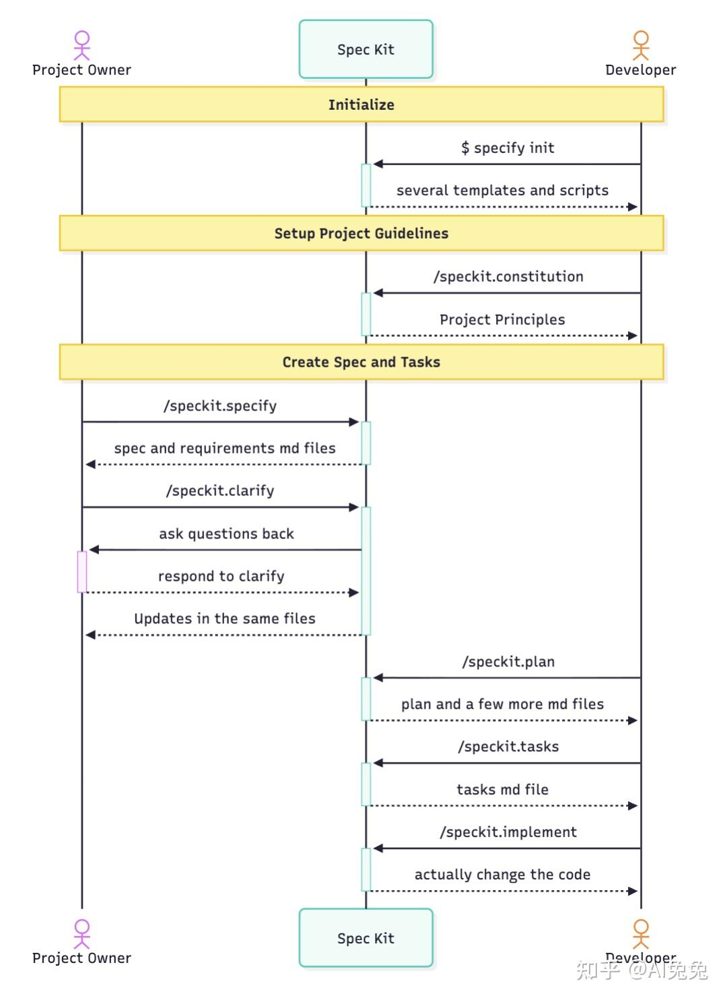
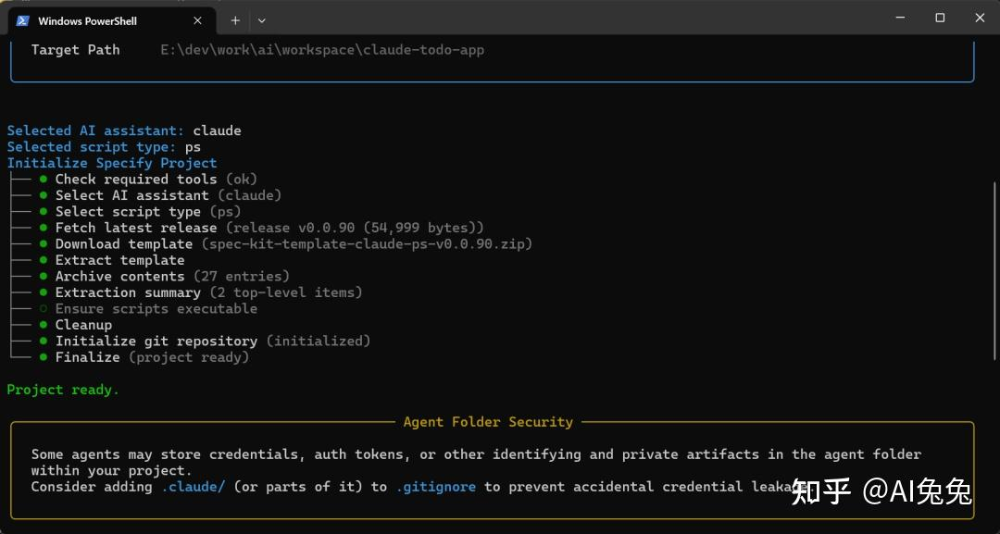
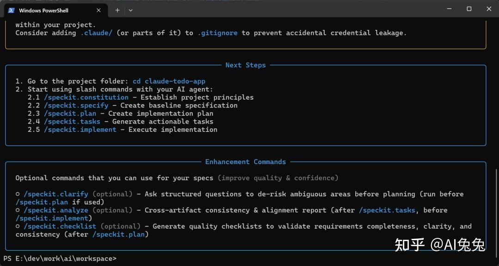
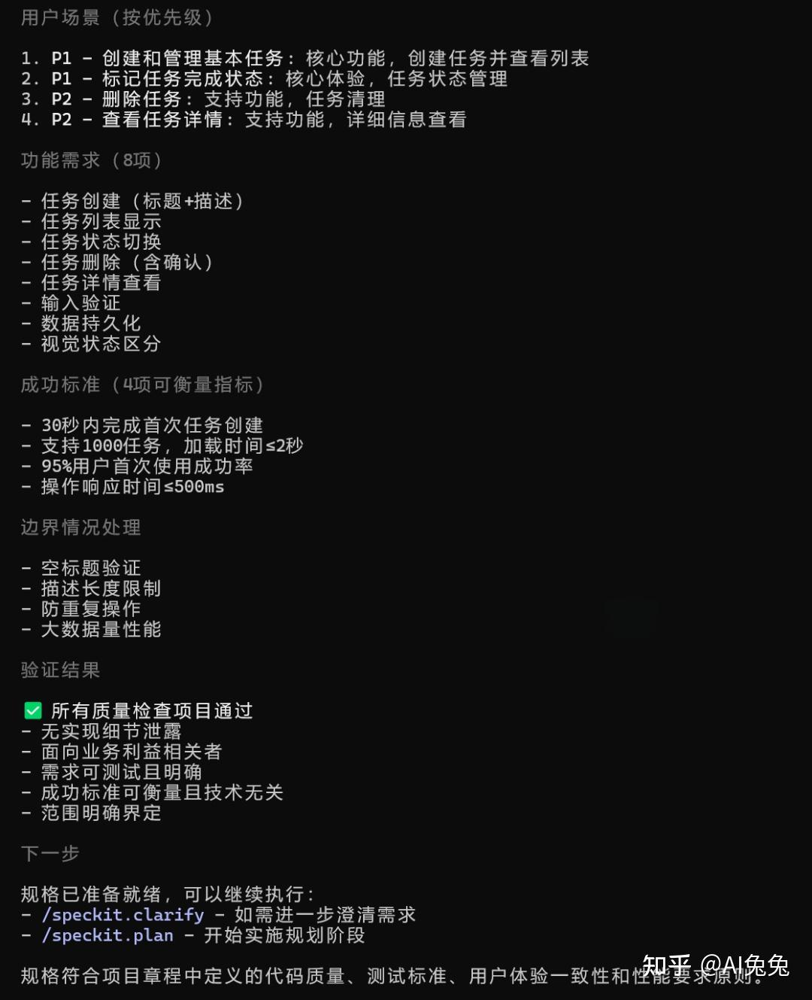
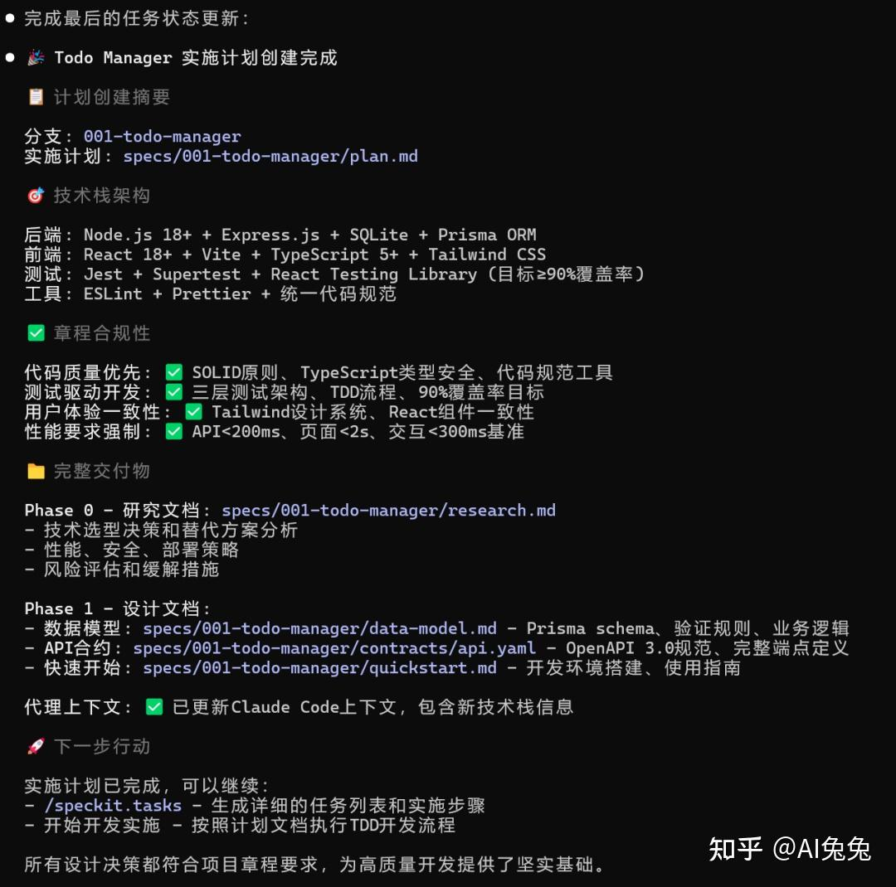
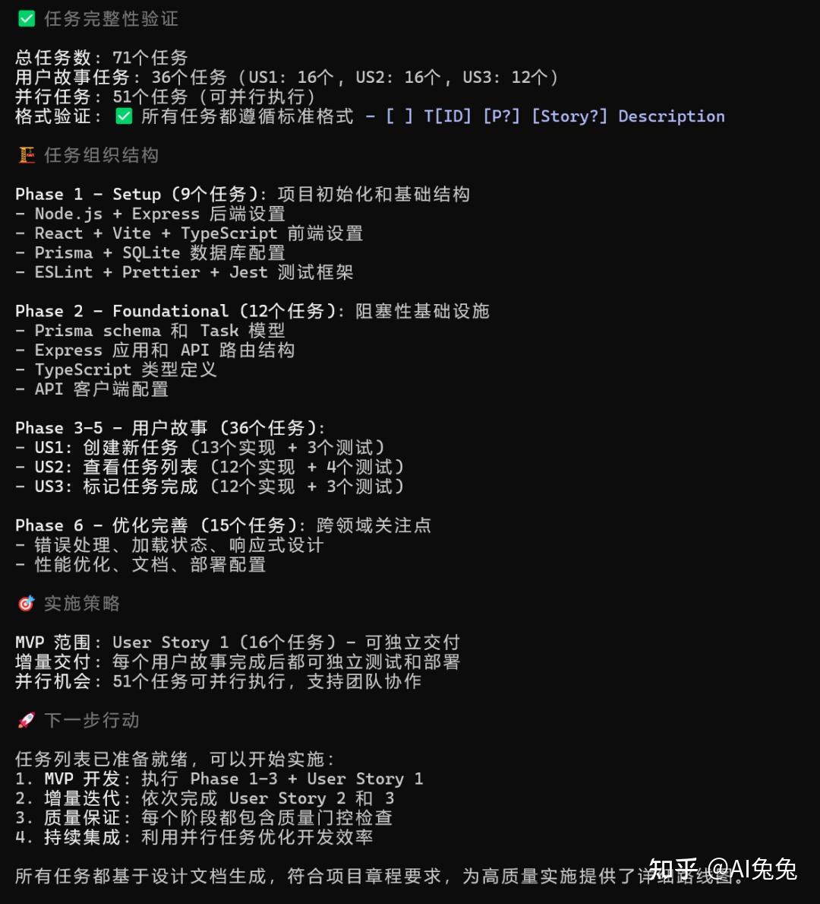
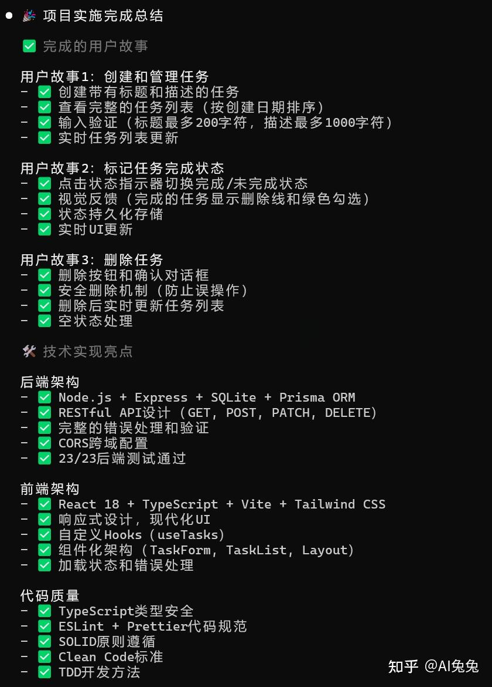
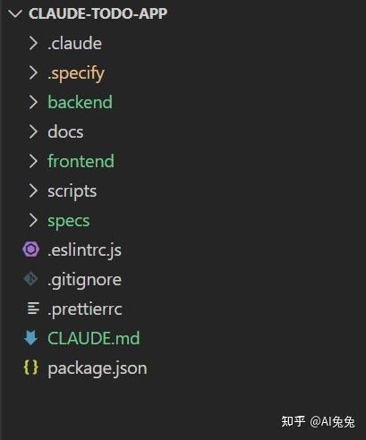

# 从零理解 GitHub Spec Kit：开发者必看的入门指南

> 知乎专栏文章（作者未署名）。原文链接：https://zhuanlan.zhihu.com/p/1981659360842249886
> 正文由 r.jina.ai 渲染抓取，zhida 搜索追踪链接已清理；文章配图（9 张操作截图/流程图）保存在本目录 `spec-kit-zhihu-imgs/` 下。

你是否也曾陷入这样的开发困境？

直接对 AI 助手说「帮我写个XX功能」，然后花大量时间修正它那不尽如人意的代码；团队沟通需求靠零散的聊天记录，项目进展凭感觉走，最终导致返工和混乱。

说实话，这种依赖直觉、漫无目的的开发方式，我称之为「Vibe Coding」（感觉式编程）。

**这种看似敏捷的开发方式，本质上是对项目熵增的放任。**

它或许能应对小修小补，但对于严肃的软件工程项目，这无异于一场灾难。

所幸的是，我们不必一直如此。GitHub 近期发布了一套名为 Spec Kit 的工具，它由微软开发，旨在为 AI 驱动的软件开发提供一套清晰、规范的「脚手架」和方法论。

本文将带你从零开始，深入理解 Spec Kit 的核心理念与完整工作流，帮助你彻底告别「感觉式编程」，拥抱更专业、更结构化的开发模式。

## Spec Kit 的精髓 —— 什么是「规格驱动开发」？

Spec Kit 的核心，是一种被称为「规格驱动开发」（Spec-Driven Development, SDD）的思想。

我个人认为，SDD 的精髓在于它强制我们回归软件工程的本源：**先想清楚「做什么」和「为什么做」，再动手「怎么做」。**

这恰恰是解决「Vibe Coding」问题的关键。Spec Kit 通过一套结构化的流程和工具，确保 AI 和开发者在同一个清晰的蓝图下工作。

## SDD 的四大关键词

SDD 的理念可以概括为四个关键词：

- **`Intent first`**：明确要「做什么/为什么」，再谈实现细节；
- **`Rich specs`**：用结构化的规格与检查清单约束 AI；
- **`Multi-step refinement`**：多阶段收敛替代一次性大 Prompt；
- **`Model-agnostic control`**：与多种代理协同但不绑定技术栈。

## SDD 的六大核心原则

这套思想进一步具化为六大核心原则，它们共同构成了 Spec Kit 的「方法论骨架」：

1. **规格是主要产物**：代码只是规格的一种实现。这彻底扭转了「代码为王」的传统观念。
2. **可执行的规范**：规范必须足够精确，能够生成可工作的系统，杜绝模棱两可。
3. **持续细化**：开发是一个持续验证和调整的过程，而不是一次性活动。
4. **研究驱动的背景**：在动手前，通过专门的「研究代理」收集足够的技术和业务背景信息。
5. **双向反馈**：生产环境的实际表现（如性能指标、用户行为）应反向驱动规格的演进。
6. **分支探索**：支持从同一份规格探索多种技术实现路径（如追求性能、追求低成本等），方便做出最优决策。

总而言之，Spec Kit 试图为我们和 AI 之间建立一种新的协作模式：我们负责定义「规格」和「意图」，AI 则作为高效的「实现者」。

## 上手实践 —— Spec Kit 完整工作流七步详解

理论讲完了，让我们进入实战。Spec Kit 将复杂的软件开发流程，巧妙地拆解为七个清晰的步骤。



在开始之前，你需要先安装 Spec Kit 的命令行工具 `specify-cli`。

```bash
# 推荐使用 uv (一个极速的 Python 包管理器)
uv tool install specify-cli --from git+https://github.com/github/spec-kit.git
```

安装完成后，在你的项目根目录下运行 `specify init --here`，即可完成初始化。

接下来，我们将逐一拆解这七个核心步骤。

### 1. 制定宪法（/constitution）

这是项目启动的第一步，也是最重要的一步。

- **目的**：为项目建立一套最高准则，包括技术原则、代码规范、安全要求、质量标准等。这份「宪法」将成为后续所有技术决策的基石。
- **产出**：生成 `.specify/memory/constitution.md` 文件。

> **实践者贴士**：我通常会把团队的技术栈偏好、部署环境要求、甚至对第三方库的选用原则都写入「宪法」。这样，AI 在后续规划技术方案时，就不会天马行空。

### 2. 创建功能规范（/specify）

这是定义「做什么」的关键环节。

- **目的**：用自然语言清晰、完整地描述你要构建的功能、用户故事和验收标准。**注意，此阶段完全不涉及技术实现**。
- **产出**：在 `specs/` 目录下创建一个以功能命名的文件夹，并生成核心的 `spec.md` 文件。

> **实践者贴士**：写 `spec` 时，把自己当成产品经理。描述越具体越好，例如「用户点击完成按钮后，任务项应变为灰色，并移动到列表底部」，而不是「用户可以完成任务」。

### 3. 澄清需求（/clarify）（可选）

这是在制定技术方案前，消除模糊地带的关键一步。

- **目的**：让 AI 角色扮演一位挑剔的测试人员或产品经理，对你写的 `spec.md` 提出问题，帮助你发现其中描述不清或有歧义的地方。
- **产出**：对 `spec.md` 的补充和修正。

> **实践者贴士**：这是我最喜欢的一个环节。它强制我在编码前，就把所有可能的边界情况和异常流程想清楚，能有效减少后期返工。

### 4. 生成技术方案（/plan）

AI 从「产品经理」切换为「架构师」角色，开始设计「怎么做」。

- **目的**：基于 `spec.md` 和 `constitution.md`，制定一份详细的技术实现计划，包括技术选型、架构设计、数据模型、API 契约等。
- **产出**：生成 `plan.md`、`data-model.md` 等一系列设计文档。

> **实践者贴士**：如果 AI 给出的技术方案不符合你的预期（例如，选了一个你不熟悉的库），可以直接让它修改。整个过程你始终拥有最终决策权。

### 5. 分析计划（/analyze）（可选）

在分派任务前，进行最后一次「沙盘推演」。

- **目的**：让 AI 检查所有已生成的工件（spec, plan 等），分析是否存在矛盾、遗漏或不一致的地方，确保计划的完备性和可行性。
- **产出**：一份分析报告，指出潜在的问题。

> **实践者贴士**：这一步虽然不是强制的，但我强烈建议不要跳过。它就像代码审查（Code Review）一样，能在早期发现许多高成本的错误。

### 6. 生成任务列表（/tasks）

将宏伟的蓝图分解为具体的施工步骤。

- **目的**：将 `plan.md` 中的技术方案，自动分解为一张详细、可执行、有依赖关系的任务清单。
- **产出**：生成 `tasks.md` 文件，其中每个任务都清晰明了。

> **实践者贴士**：`tasks.md` 文件是与 AI 协作的核心界面。你可以随时介入，手动调整任务的优先级，或者将某些任务标记为自己完成。

### 7. 执行实现（/implement）

万事俱备，AI 开始化身「程序员」，将任务逐一实现。

- **目的**：根据 `tasks.md`，按顺序、有条不紊地执行所有开发任务，生成最终的代码。
- **产出**：可运行的应用程序代码。

> **实践者贴士**：你可以让 AI 一次性执行所有任务，也可以一个一个地执行。对于复杂任务，我更喜欢后者，这样可以随时检查每一步的产出，确保一切尽在掌握。

通过这七个步骤，Spec Kit 将一个模糊的「想法」，逐步精炼成一套结构清晰、文档齐全、代码可靠的软件项目。

## 实战：用 Spec-Kit + Claude Code 开发「任务管理器」应用

接下来，我将演示如何一步步使用 spec-kit 开发「任务管理器」应用。

### 第一步：初始化项目

在你的工作目录文件夹中打开终端，运行：

```bash
# 初始化一个 specify 项目
specify init claude-todo-app
```

接下来，根据提示选择你使用的 AI 工具（这里我们选 Claude Code），它会自动完成初始化配置。





这个命令会：

- 创建 `spec` 相关文件夹和模板文件。
- 配置好 `specify` 和 Claude Code。
- 设置好所有需要的斜杠命令。

### 第二步：启动 Claude Code

在终端输入 `claude` 启动。启动后你就会看到 `spec-kit` 提供的一系列斜杠命令：

- `/speckit.constitution`
- `/speckit.specify`
- `/speckit.plan`
- `/speckit.tasks`
- `/speckit.implement`

### 第三步：遵循流水线，开始开发

**1️⃣ 建立项目原则**

我使用 `/speckit.constitution` 命令，为我的「任务管理器」应用创建了开发原则，这能确保 AI 在后续每一步都牢记这些核心要求：

> 制定以代码质量、测试标准、用户体验一致性及性能要求为核心的原则

**2️⃣ 描述功能需求**

接着，使用 `/speckit.specify` 告诉 AI 你想要什么。记住，只谈功能，不谈技术！

```
建立一个简单、清晰、可扩展的任务管理器（Todo App）示例项目，让用户能够：

- 创建任务（包含标题与描述）
- 删除任务
- 查看任务
- 查看任务列表
- 标记任务为完成
```



**3️⃣ 定义技术方案**

需求明确后，执行 `/speckit.plan`。技术方案可以让 AI 自动生成，也可以自己定义：

```
1. **后端**：使用 Node.js + Express，并采用 SQLite 数据库（通过 ORM 操作）
2. **前端**：一个简单的 React 应用，使用 React + Vite 构建
3. **测试**：包含后端 API 测试与前端组件测试（如使用 Jest、Supertest、React Testing Library）
4. **文档**：提供完整的使用与开发说明
5. **代码风格**：ESLint + Prettier，统一项目代码风格
```

Claude Code 会基于之前的需求和原则，提出一套完整的技术方案：

- 确定技术栈
- 生成项目架构设计
- 创建数据模型
- 创建快速开始指南



**4️⃣ 生成任务清单**

方案确认后，使用 `/speckit.tasks` 命令。Claude 会自动分析 `plan` 文件，生成一份详细、可执行的任务列表。



**5️⃣ 开始实现**

万事俱备，现在只需执行 `/speckit.implement`。Claude 就会像一个经验丰富的工程师，按照任务清单逐一完成代码实现。



**最终成果**

经过上面几个步骤，我的「任务管理器」应用就成功开发出来了！

项目结构清晰可见：



产品运行效果：


## 实用技巧

**1、每一步都可以反复修改**

- 觉得 `spec` 不对？直接让 Claude 修改。
- 技术栈想换？重新运行 `/speckit.plan` 即可。

**2、使用 `/speckit.clarify` 澄清需求**

- 在 `plan` 之前运行，可以让 Claude 主动向你提问，把需求细节弄得更清楚，避免后面返工。

**3、检查 `Checklist`**

- 每个 `spec.md` 文件里都有一个 `Review Checklist`，可以用来检查 AI 的交付物是否满足预期。

**4、随时中断并调整**

- Claude 不会一次性跑完所有任务，你可以在过程中随时介入，修正它的方向。

## 核心要点

- 不要一上来就让 Claude 写代码，先走 `spec-kit` 流程。
- `Specify` 阶段不谈技术，只谈业务需求。
- `Plan` 阶段再定技术栈，让决策有理有据。
- `Implement` 前确保 `Spec` 和 `Plan` 都已确认无误。

这样用下来，Claude 生成的代码质量会比直接「Vibe Coding」高很多，而且文档齐全、思路清晰！

## 总结 —— 不只是工具，更是一种工程思维的转变

讲到这里，相信大家也能明白，Spec Kit 带给我们的，远不止是一个命令行工具或一套项目模板。

**它的核心价值，在于引导我们从「Vibe Coding」的随性，转向「Spec-Driven」的严谨。**

这本质上是一种工程思维的转变：将沟通、设计、规划前置，把开发过程从不可控的「黑盒」，变为一个结构清晰、步步为营的「白盒」。它让我们重新成为开发过程的主导者，而 AI 则是我们手中那把锋利而可靠的瑞士军刀。

**SDD 特别适用于：**

- **从零开始的全新项目**：需要从头设计架构的场景。
- **复杂功能开发**：涉及多个子模块或组件协同工作。
- **团队协作项目**：需要通过对齐需求来避免高昂的沟通成本与返工。
- **需要最终落地为生产代码的快速原型**。
- **遗留系统现代化改造**：通过记录设计意图来避免功能回归和不可控风险。

**以下情况可以不使用 SDD：**

- **简单且显而易见的 bug 修复**。
- **小范围的 UI 微调**。
- **真正的探索式开发**：当你仍在摸索需求、尚未明确方向时。

如果你也对提升 AI 协作开发的质量和效率感兴趣，不妨在你的下一个项目中，尝试一下 Spec Kit。
